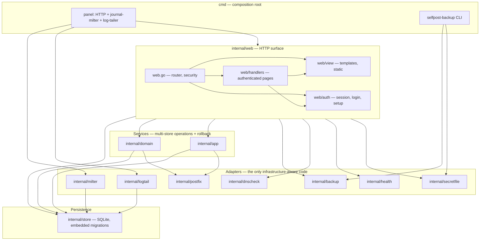

# SelfPost — architecture (as-built)

**Source of truth:** the code tree, not historical specs. Synchronise this file
when env keys, routes, or mail-path behaviour change. Verification method:
[development.md](development.md) § «Verifying docs against code».

User install/operations: [README.md](../README.md), [guide.md](guide.md). Product boundaries:
[product.md](product.md).

---

## Image and processes

Single Debian slim image. `entrypoint.sh` (root) fixes `/data` ownership and
milter socket directories, **requires** `SELFPOST_HOSTNAME` (FQDN with at least
one dot; no scheme, port, or spaces — invalid or empty value → `exit 1` before
Postfix config or supervisord), then execs `supervisord` as PID 1.

The hostname is not a tunable default: it must match PTR/rDNS, TLS CN/SAN, and
SASL realm together. Soft fallbacks (`localhost` in the panel vs container ID in
Postfix) split realms and break SMTP AUTH with a silent `535` in clients while
the panel looks healthy. Shipped `docker-compose.yml` already requires the
variable; the entrypoint gate catches `docker run`, custom compose, and k8s.

Managed programs ([build/supervisord.conf](../build/supervisord.conf)):

| Program | User | Priority | Role |
|---|---|---|---|
| `opendkim` | root → `opendkim` (`UserID` in opendkim.conf) | 100 | DKIM signing milter |
| `panel` | panel | 200 | HTTP UI + journal-milter + log-tailer goroutine |
| `postfix` | root (wrapper) | 300 | MTA — started only after both milter sockets exist |
| `postfix-reload` | root | — | On-demand `postfix reload` (autostart off) |
| `cert-reload` | root | 400 | Daily `postfix reload` for renewed TLS certs |
| `logrotate` | root | 400 | Periodic `mail.log` rotation |

Start order: OpenDKIM → panel (opens journal-milter socket) → Postfix wrapper
polls unix sockets (timeout `MILTER_WAIT_TIMEOUT`, default 30s) then
`postfix start-fg`.

`crashexit` event listener exits the container on any managed process FATAL so
Docker `restart: unless-stopped` recreates a broken instance.

**Liveness:** `GET /healthz` (unauthenticated) returns 200 when opendkim,
panel, and postfix are RUNNING; Docker `HEALTHCHECK` uses the same probe.

---

## Mail path

```
Client ──TLS+SASL──► Postfix (465 smtps, optional 587 submission)
                         │
                         ├─► OpenDKIM milter (sign, tempfail on failure)
                         ├─► journal-milter (send log + L2 rate limits, fail-open)
                         └─► outbound MX delivery (port 25 client)
```

### Postfix ([build/postfix-config.sh](../build/postfix-config.sh))

- **465/smtps** — implicit TLS, SASL required; primary listener.
- **587/submission** — only when `SUBMISSION_ENABLE=true`; STARTTLS with
  `smtpd_tls_security_level=encrypt`.
- **No open relay** — `permit_sasl_authenticated`, `reject_unauth_destination`;
  `smtpd_sender_login_maps` + `reject_sender_login_mismatch`.
- **Level-1 rate limit** — `smtpd_client_message_rate_limit` /
  `anvil_rate_time_unit` from `RATE_LIMIT_*` env vars; independent of milter.
- **Chroot disabled** for all services (DNS/TLS inside container).
- **TLS certs** — read-only mount at `TLS_CERT_FILE` / `TLS_KEY_FILE`; daily
  reload via `cert-reload`.

### OpenDKIM

Per-domain keys under `/data/opendkim/keys`; `KeyTable` / `SigningTable` maintained
by the panel. Socket `/run/opendkim/opendkim.sock`.

### Panel binary ([cmd/panel](../cmd/panel))

One process, three roles:

1. **HTTP server** — `:8080` (`PANEL_HTTP_ADDR`); HTTPS terminated by reverse
   proxy only.
2. **journal-milter** — unix socket `JOURNAL_MILTER_SOCKET`; records From/To/
   Subject/SASL user at DATA; enforces level-2 rate limits; **fail-open**
   (`default_action=accept`) so milter failure does not stop mail. Domain
   ceilings apply to every client IP; an application ceiling with trusted IPs
   raises the limit for those IPs only and skips the domain check (guide § Rate
   limiting). The level-2 count is the stored send-log rows plus the messages
   this process has admitted but not yet written (`internal/milter/inflight.go`),
   so concurrent sessions cannot each spend the same last slot; a reservation
   is released at end-of-message, on ABORT, or after a 10-minute TTL.
3. **log-tailer** — follows `MAIL_LOG`, updates send-log delivery status by
   queue-id. Send-log `queued → sent` transitions depend on this goroutine alone
   (`UpdateStatus` is only called from [internal/logtail](../internal/logtail/logtail.go)).

Milter chain in Postfix: OpenDKIM (tempfail) then journal (accept on failure).

### Log tailer and `mail.log` rotation

`mail.log` lives at `/data/log/mail.log` — inside the persistent bind mount, so
the delivery lines that resolve a `queued` send-log row are not lost when the
container is recreated. `postlogd` writes it as user `postfix`; the panel reads
it through the shared `selfpost` group (directory `2750 postfix:selfpost`, file
`0640`, both normalised on every start by
[build/entrypoint.sh](../build/entrypoint.sh)). The path is one default in two
places, `maillog_file` in [build/postfix-config.sh](../build/postfix-config.sh)
and `MAIL_LOG` in [cmd/panel/main.go](../cmd/panel/main.go). Backups exclude
`log/`: it is diagnostic output, not state to restore.

Rotation uses rename + `postfix reload`
([build/logrotate-mail.conf](../build/logrotate-mail.conf)), not `copytruncate` —
the latter can drop `status=sent` lines and leave send-log rows stuck at
`queued`. After rename, logrotate runs `create 0640 postfix selfpost` (postlogd
recreates the file lazily on first write as mode `0600`, which the unprivileged
panel user cannot read). `follow()` drains the old inode once more before
switching descriptors; the panel treats a missing log file as an empty tail, not
an error.

**Read offset is persisted** (`logtail_state` table, migration `0003`): the
tailer stores its position plus a fingerprint of the log's first 512 bytes, and
on start resumes from it, parsing the tail written while the panel was down. If
the fingerprint no longer matches (rotated or recreated in the meantime) it reads
the current file from the start; re-parsing lines is harmless because
`UpdateStatus` writes the same status onto the same row. Only a first-ever start,
with nothing stored, begins at end-of-file, so installing the panel does not
replay a pre-existing log.

**Queue reconcile** is the backstop for what the log cannot explain at all: a
row still `queued` more than two minutes after it was accepted, whose queue id
`postqueue -p` no longer lists, is marked `bounced` (swept every five minutes,
[internal/logtail](../internal/logtail/logtail.go),
[postfix.QueueIDs](../internal/postfix/queue.go)). Postfix having dropped the
message means nothing more will ever be reported about it, so the row can only
be closed on an assumption, and it is closed as a failure because a delivery the
panel cannot evidence must not be shown as one. Three things keep the sweep from
guessing where it need not: it starts only after the tailer has read to
end-of-file once (on a restart the log itself holds the answer), the two-minute
grace covers messages merely in flight, and a `postqueue` that cannot be read
leaves every row untouched rather than closing them all. Now that the log
survives the container, reaching this path means the lines are gone for good —
rotated past fourteen files while the panel was down, or deleted.

**Two one-shot reads** sit beside the follow loop and are unrelated to it, both
serving panel pages on request: `TailLines` (the last *n* lines, for
`/system-log`) and `QueueLines` (the lines carrying one queue-id, for
`/deliveries/{id}`). `QueueLines` scans a bounded tail of the current file —
finding a message's lines means reading rather than seeking — and matches the id
anchored on the character before it, since queue ids are hexadecimal runs and a
shorter one is regularly the tail of a longer one. Send-log rows outlive the log
(retention 90 days, rotation 14 files), so an empty result is the expected end
state for an older message and the page reports it as such, not as a failure.

---

## Panel HTTP surface

Canonical routes: [internal/web/web.go](../internal/web/web.go). Authenticated
unless noted. Routes marked **global** return **404** for domain administrators
(`requireGlobal()` in
[internal/web/handlers/authz.go](../internal/web/handlers/authz.go)). The table
below is a summary — HTMX fragment endpoints
(`/status/fragment`, `/deliveries/rows`, `/mail-queue/body`,
`/system-log/body`, …) and every POST variant live in `web.go`.

| Route | Purpose |
|---|---|
| `/healthz` | Liveness (no auth) |
| `/license` | Embedded `LICENSE` text (no auth) |
| `/setup/*` | One-time admin bootstrap |
| `/login`, `/logout` | Session auth |
| `/account` | 308 redirect to `/settings` (pre-1.2.3 route, kept as a compat shim) |
| `/status`, `/status/*` | **Global.** Process, cert, socket, PTR checks; machine CPU/memory/network |
| `/domains` | Domain list; `POST /domains` (add domain) is **global** |
| `/domains/{id}`, `/domains/{id}/*` | Assigned-domain detail for domain-admins; delete domain is **global** |
| `/domains/import` | **Global.** Domain import (`POST`; form on the Backup page) |
| `/deliveries`, `/deliveries/{id}` | Send log with filters; scoped to assigned domains for domain-admins |
| `/mail-queue`, `/mail-queue/*` | **Global.** Postfix queue view |
| `/system-log`, `/system-log/*` | **Global.** `mail.log` tail |
| `/reload` | **Global.** `POST` — reload OpenDKIM + Postfix maps |
| `/backup`, `/backup/*` | **Global.** Full backup download (page also hosts the import form) |
| `/settings` | Username/password for any user; DMARC report default is **global** only |
| `/users`, `/users/*` | **Global.** Panel user CRUD |

HTMX polling refreshes monitoring fragments (5 s while the operator is active on
the page, 30 s when the tab is visible but idle, none when hidden — scheduled in
`panel.js` via `data-poll`, not `hx-trigger="every …"`); polling does not extend
session idle timeout (only non-`HX-Request` GET and mutating requests count as
activity).

### Sessions

Stored in SQLite (`sessions` table, migration `0002`): cookie holds a random
token; the database stores **SHA-256 of the token**, not the token itself — a
stolen DB or backup archive does not alone grant login, but a browser that still
holds the cookie works after process restart, redeploy, or full backup restore.

- **Idle timeout** — sliding window, `PANEL_SESSION_IDLE_DAYS` (default 7); no
  absolute cap (regular use keeps the session alive indefinitely).
- **Renewal** — DB `last_seen` and cookie `Max-Age` update at most once per hour
  (`renewThreshold` in [internal/web/auth/session.go](../internal/web/auth/session.go)).
- **Password change on `/settings`** — changing your own password deletes
  every other session for that user; the current session stays active
  ([internal/store/sessions.go](../internal/store/sessions.go),
  [handlers_settings.go](../internal/web/handlers/handlers_settings.go)).
  A global administrator resetting another user's password on `/users` updates
  the hash but does not delete that user's existing sessions.

Restoring an **older** backup also restores session rows: a session removed
after that backup was taken can become valid again if the browser still holds
the cookie and the restored row's `expires_at` has not passed.

---

## Code layers

Multi-store writes that must land in more than one place (SQLite row,
`sasldb2` entry, Postfix map, OpenDKIM table) go through a service, which is
also where the rollback of a partial failure lives. Handlers may call
`store` directly for single-table reads and simple writes (sessions, admin,
send-log queries); the first-run setup-token file is read and written in
`web` itself. The adapters below the services are the only code that knows
about Postfix, OpenDKIM, DNS or the log file, which is what makes them
substitutable in tests — `milter.Store`, `app.SenderMaps` and
`logtail.StatusStore` are the seams the unit tests replace with fakes.



The three roles inside the `panel` process (HTTP server, journal-milter,
log-tailer goroutine) share one binary and one SQLite handle on purpose — see
[Panel binary](#panel-binary-cmdpanel) for why, and *Persistence* below for the
single-connection trade-off that follows from it.

---

## Persistence (`/data` bind mount)

| Path | Contents |
|---|---|
| `selfpost.db` | SQLite: domains, apps, admin, sessions, send log, L2 limits, log-tailer offset |
| `setup-token` | First-run setup token file |
| `opendkim/` | DKIM keys + tables |
| `sasl/sasldb2` | Application SASL credentials |
| `postfix/sender_login_maps` | Login → From binding |
| `postfix/queue/` | Postfix transit mail (deferred/active); survives container recreate |
| `log/mail.log` | Postfix delivery log + rotated copies (excluded from backups) |
| `manifest.json` | Backup version stamp (consumed on restore) |

Not in `/data`: TLS certificates for the panel (reverse-proxy mount) — though
full backups also archive the operator's `./certs` PEM files when present.

**Rotation:** send-log retention `SEND_LOG_RETENTION_DAYS` (default 90);
`mail.log` via logrotate (14 rotated files, check every 6h, rename +
`postfix reload` in `postrotate` — see § Log tailer above).

**Restore:** panel button or `selfpost-backup` CLI — self-contained archive:
`data/` (SQLite snapshot + tree minus `log/`, the setup token and any `tls/`
under `/data`), `docker-compose.yml`, `.env`, and `certs/` when present;
version check on restore. Requires the project directory mounted read-only at
`SELFPOST_DEPLOY_ROOT` (`/selfpost-deploy` in the default compose file). On the
first successful boot after restore, the panel runs one **Resync** — OpenDKIM's
tables and Postfix's sender map are re-derived from SQLite and both daemons are
reloaded, so drift between the extracted archive and the database is healed
before mail flows (same step as `POST /reload` on demand). Stopped-container
`tar` of `./data` alone remains possible for state-only copies (see guide).

**Optional encryption** of the two secret-bearing downloads
([internal/secretfile](../internal/secretfile/secretfile.go)): password →
scrypt → AES-256-GCM over 64 KiB chunks, each authenticated with the header,
its counter and an end-of-stream flag (so truncation and reordering fail to
open). Full backup `.tar.gz` → `.spbk` (SelfPost backup), domain export
`.json` → `.spde` (SelfPost domain export); the plain forms remain the
default. Domain import detects the envelope by magic bytes; an encrypted full
backup is converted back with `selfpost-backup -decrypt` before restore.

---

## Security (summary)

Mandatory checklist: [security.md](security.md). Accepted trade-offs (CSRF
origin check, no CSRF tokens) are documented there separately.

---

## Configuration

Public env vars: [guide § Environment variables](guide.md#environment-variables).
Regression test: [cmd/panel/envdoc_test.go](../cmd/panel/envdoc_test.go).

**Internal env vars.** The following are read by the panel or startup scripts
but are not part of the operator interface — not meant to be changed in a
normal deployment; documented here so an accidental override reads as
unsupported rather than as a missing doc:

- **Panel paths and tuning:** `SELFPOST_DATA_DIR` (`/data`), `SELFPOST_DB_PATH`
  (`/data/selfpost.db`), `SELFPOST_SETUP_TOKEN_FILE`
  (`/data/setup-token`), `PANEL_HTTP_ADDR` (`:8080`),
  `JOURNAL_MILTER_SOCKET` (`/run/selfpost/journal.sock`), `MAIL_LOG`
  (`/data/log/mail.log` — read by the panel and written by Postfix, so a change
  here has to be matched in `build/postfix-config.sh`),
  `PANEL_COOKIE_SECURE` (`true`), `OPENDKIM_SOCKET`
  (`/run/opendkim/opendkim.sock`), `OPENDKIM_DIR` (`/data/opendkim`),
  `DKIM_SELECTOR_DEFAULT` (`selfpost`), `SASL_DB_PATH`
  (`/data/sasl/sasldb2`), `SASL_REALM` (defaults to `SELFPOST_HOSTNAME`),
  `POSTFIX_DIR` (`/data/postfix`), `POSTFIX_SENDER_LOGIN_MAPS`
  (`/data/postfix/sender_login_maps` — read by Postfix config only; the panel
  always writes `<POSTFIX_DIR>/sender_login_maps`, so overriding this env alone
  desyncs the map Postfix reads from the file the panel maintains),
  `POSTFIX_QUEUE_DIR` (`/data/postfix/queue` — set in `build/postfix-config.sh`),
  `SELFPOST_DEPLOY_ROOT` (`/selfpost-deploy` — operator project directory for
  full backups; mount `.:/selfpost-deploy:ro` in compose).
- **Milter and Postfix startup:** `MILTER_CONNECT_TIMEOUT` (`15s`),
  `MILTER_COMMAND_TIMEOUT` (`15s`), `MILTER_CONTENT_TIMEOUT` (`30s`),
  `MILTER_WAIT_TIMEOUT` (`30` seconds).
- **Background maintenance:** `TLS_RELOAD_INTERVAL_SECONDS` (`86400` — daily
  `postfix reload` to pick up renewed certificates),
  `LOGROTATE_INTERVAL_SECONDS` (`21600` — check `mail.log` rotation every six
  hours; logrotate keeps 14 rotated files on a daily schedule, and each
  rotation triggers `postfix reload`).
