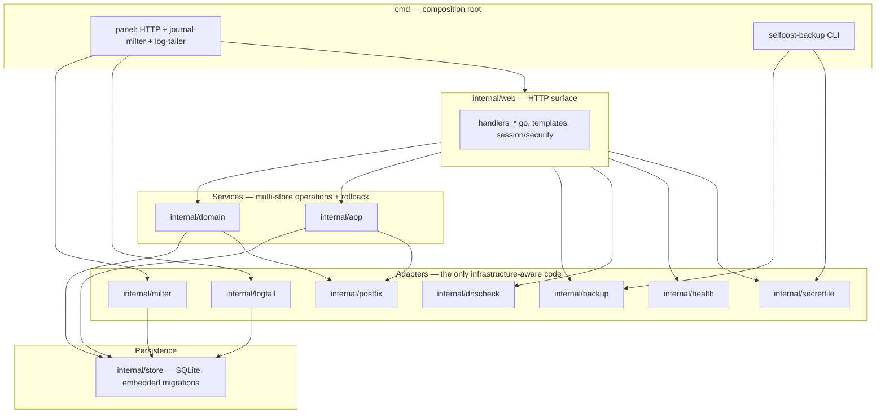

# SelfPost — architecture (as-built)

**Source of truth:** the code tree, not historical specs. Synchronise this file
when env keys, routes, or mail-path behaviour change. Verification method:
[documentation-plan.md](documentation-plan.md) §2.

User install/operations: [README.md](../README.md). Product boundaries:
[product.md](product.md).

---

## Image and processes

Single Debian slim image. `entrypoint.sh` (root) fixes `/data` ownership and
milter socket directories, **requires** `SELFPOST_HOSTNAME` (FQDN with at least
one dot; no scheme, port, or spaces — invalid or empty value → `exit 1` before
Postfix config or supervisord), then execs `supervisord` as PID 1.

The hostname is not a tunable default: it must match PTR/rDNS, TLS CN/SAN, and
SASL realm together. Soft fallbacks (`localhost` in the panel vs container ID in
Postfix) split realms and break SMTP AUTH with a silent `535` in clients while
the panel looks healthy. Shipped `docker-compose.yml` already requires the
variable; the entrypoint gate catches `docker run`, custom compose, and k8s.

Managed programs ([build/supervisord.conf](../build/supervisord.conf)):

| Program | User | Priority | Role |
|---|---|---|---|
| `opendkim` | opendkim | 100 | DKIM signing milter |
| `panel` | panel | 200 | HTTP UI + journal-milter + log-tailer goroutine |
| `postfix` | root (wrapper) | 300 | MTA — started only after both milter sockets exist |
| `postfix-reload` | root | — | On-demand `postfix reload` (autostart off) |
| `cert-reload` | root | 400 | Daily `postfix reload` for renewed TLS certs |
| `logrotate` | root | 400 | Periodic `mail.log` rotation |

Start order: OpenDKIM → panel (opens journal-milter socket) → Postfix wrapper
polls unix sockets (timeout `MILTER_WAIT_TIMEOUT`, default 30s) then
`postfix start-fg`.

`crashexit` event listener exits the container on any managed process FATAL so
Docker `restart: unless-stopped` recreates a broken instance.

**Liveness:** `GET /healthz` (unauthenticated) returns 200 when opendkim,
panel, and postfix are RUNNING; Docker `HEALTHCHECK` uses the same probe.

---

## Mail path

```
Client ──TLS+SASL──► Postfix (465 smtps, optional 587 submission)
                         │
                         ├─► OpenDKIM milter (sign, tempfail on failure)
                         ├─► journal-milter (send log + L2 rate limits, fail-open)
                         └─► outbound MX delivery (port 25 client)
```

### Postfix ([build/postfix-config.sh](../build/postfix-config.sh))

- **465/smtps** — implicit TLS, SASL required; primary listener.
- **587/submission** — only when `SUBMISSION_ENABLE=true`; STARTTLS with
  `smtpd_tls_security_level=encrypt`.
- **No open relay** — `permit_sasl_authenticated`, `reject_unauth_destination`;
  `smtpd_sender_login_maps` + `reject_sender_login_mismatch`.
- **Level-1 rate limit** — `smtpd_client_message_rate_limit` /
  `anvil_rate_time_unit` from `RATE_LIMIT_*` env vars; independent of milter.
- **Chroot disabled** for all services (DNS/TLS inside container).
- **TLS certs** — read-only mount at `TLS_CERT_FILE` / `TLS_KEY_FILE`; daily
  reload via `cert-reload`.

### OpenDKIM

Per-domain keys under `/data/opendkim/keys`; `KeyTable` / `SigningTable` maintained
by the panel. Socket `/run/opendkim/opendkim.sock`.

### Panel binary ([cmd/panel](../cmd/panel))

One process, three roles:

1. **HTTP server** — `:8080` (`PANEL_HTTP_ADDR`); HTTPS terminated by reverse
   proxy only.
2. **journal-milter** — unix socket `JOURNAL_MILTER_SOCKET`; records From/To/
   Subject/SASL user at DATA; enforces level-2 rate limits; **fail-open**
   (`default_action=accept`) so milter failure does not stop mail. The level-2
   count is the stored send-log rows plus the messages this process has admitted
   but not yet written (`internal/milter/inflight.go`), so concurrent sessions
   cannot each spend the same last slot; a reservation is released at
   end-of-message, on ABORT, or after a 10-minute TTL.
3. **log-tailer** — follows `MAIL_LOG`, updates send-log delivery status by
   queue-id. Send-log `queued → sent` transitions depend on this goroutine alone
   (`UpdateStatus` is only called from [internal/logtail](../internal/logtail/logtail.go)).

Milter chain in Postfix: OpenDKIM (tempfail) then journal (accept on failure).

### Log tailer and `mail.log` rotation

`mail.log` lives under `/var/log` (not in `/data`). Rotation uses rename +
`postfix reload` ([build/logrotate-mail.conf](../build/logrotate-mail.conf)), not
`copytruncate` — the latter can drop `status=sent` lines and leave send-log rows
stuck at `queued`. After rename, logrotate runs `create 0644 root root` (Postfix
recreates the file lazily on first write as mode `0600`, which the unprivileged
panel user cannot read). `follow()` drains the old inode once more before
switching descriptors; the panel treats a missing log file as an empty tail, not
an error.

**Read offset is persisted** (`logtail_state` table, migration `0003`): the
tailer stores its position plus a fingerprint of the log's first 512 bytes, and
on start resumes from it, parsing the tail written while the panel was down. If
the fingerprint no longer matches (rotated or recreated in the meantime) it reads
the current file from the start; re-parsing lines is harmless because
`UpdateStatus` writes the same status onto the same row. Only a first-ever start,
with nothing stored, begins at end-of-file, so installing the panel does not
replay a pre-existing log.

**Remaining gap:**

- **Container recreate** — `/var/log` is ephemeral; the log is lost with the
  container, so the delivery lines for rows still `queued` are gone with it and
  those rows stay `queued` forever.

Possible follow-ups if this becomes painful: mount the mail log under `/data`, or
reconcile stuck rows via `postqueue`.

---

## Panel HTTP surface

Route table: [internal/web/web.go](../internal/web/web.go). Authenticated
unless noted.

| Route | Purpose |
|---|---|
| `/healthz` | Liveness (no auth) |
| `/setup/*` | One-time admin bootstrap |
| `/login`, `/logout` | Session auth |
| `/status` | Process, cert, socket, PTR checks |
| `/domains`, `/domains/*` | Domain and application CRUD, DKIM, L2 limits |
| `/deliveries` | Send log with filters |
| `/mail-queue` | Postfix queue view |
| `/system-log` | `mail.log` tail |
| `/reload` | Reload OpenDKIM + Postfix maps |
| `/backup` | Full backup download, domain import |
| `/account` | Admin username/password |

HTMX polling refreshes monitoring fragments; polling does not extend session
idle timeout (only non-`HX-Request` GET and mutating requests count as activity).

### Sessions

Stored in SQLite (`sessions` table, migration `0002`): cookie holds a random
token; the database stores **SHA-256 of the token**, not the token itself — a
stolen DB or backup archive does not alone grant login, but a browser that still
holds the cookie works after process restart, redeploy, or full backup restore.

- **Idle timeout** — sliding window, `PANEL_SESSION_IDLE_DAYS` (default 7); no
  absolute cap (regular use keeps the session alive indefinitely).
- **Renewal** — DB `last_seen` and cookie `Max-Age` update at most once per hour
  (`renewThreshold` in [internal/web/session.go](../internal/web/session.go)).
- **Password change** — all other sessions are deleted; the current session stays
  active ([internal/store/sessions.go](../internal/store/sessions.go),
  [handlers_account.go](../internal/web/handlers_account.go)).

Restoring an **older** backup also restores session rows: a session invalidated
after that backup was taken can become valid again if the browser still has the
cookie and idle timeout has not expired.

---

## Code layers

Handlers never touch SQLite or the filesystem directly; every write that has to
land in more than one place (SQLite row, `sasldb2` entry, Postfix map, OpenDKIM
table) goes through a service, which is also where the rollback of a partial
failure lives. The adapters below the services are the only code that knows
about Postfix, OpenDKIM, DNS or the log file, which is what makes them
substitutable in tests — `milter.Store`, `app.SenderMaps` and
`logtail.StatusStore` are the seams the unit tests replace with fakes.



The three roles inside the `panel` process (HTTP server, journal-milter,
log-tailer goroutine) share one binary and one SQLite handle on purpose — see
[Panel binary](#panel-binary-cmdpanel) for why, and *Persistence* below for the
single-connection trade-off that follows from it.

---

## Persistence (`/data` bind mount)

| Path | Contents |
|---|---|
| `selfpost.db` | SQLite: domains, apps, admin, sessions, send log, L2 limits, log-tailer offset |
| `setup-token` | First-run setup token file |
| `opendkim/` | DKIM keys + tables |
| `sasl/sasldb2` | Application SASL credentials |
| `postfix/sender_login_maps` | Login → From binding |
| `manifest.json` | Backup version stamp (consumed on restore) |

Not in `/data`: TLS certificates (reverse-proxy mount), Postfix queue
(transit mail not migrated by design).

**Rotation:** send-log retention `SEND_LOG_RETENTION_DAYS` (default 90);
`mail.log` via logrotate (14 rotated files, check every 6h, rename +
`postfix reload` in `postrotate` — see § Log tailer above).

**Backup:** panel button or `selfpost-backup` CLI — SQLite snapshot + tar of
`/data` tree; version check on restore. Stopped-container `tar` of `./data` is
safe (see README).

**Optional encryption** of the two secret-bearing downloads
([internal/secretfile](../internal/secretfile/secretfile.go)): password →
scrypt → AES-256-GCM over 64 KiB chunks, each authenticated with the header,
its counter and an end-of-stream flag (so truncation and reordering fail to
open). Full backup `.tar.gz` → `.spbk`, domain export `.json` → `.spde`; the
plain forms remain the default. Domain import detects the envelope by magic
bytes; an encrypted full backup is converted back with `selfpost-backup
-decrypt` before restore.

---

## Security (summary)

Mandatory checklist: [security.md](security.md). Accepted trade-offs (CSRF
origin check, no CSRF tokens) are documented there separately.

---

## Configuration

Public and internal env vars: [README § Environment variables](../README.md#environment-variables).
Regression test: [cmd/panel/envdoc_test.go](../cmd/panel/envdoc_test.go).
