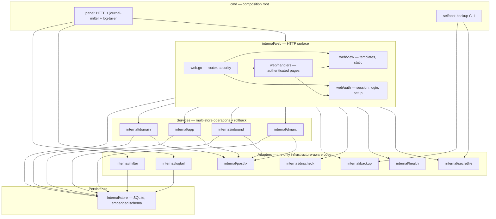

# SelfPost — architecture (as-built)

**Source of truth:** the code tree, not historical specs. Synchronise this file
when env keys, routes, or mail-path behaviour change. Verification method:
[development.md](development.md) § «Verifying docs against code».

User install/operations: [README.md](../README.md), [guide.md](guide.md). Product boundaries:
[product.md](product.md).

---

## Image and processes

Single Debian slim image. `entrypoint.sh` (root) fixes `/data` ownership and
milter socket directories, **requires** `SELFPOST_HOSTNAME` (FQDN with at least
one dot; no scheme, port, or spaces — invalid or empty value → `exit 1` before
Postfix config or supervisord), then execs `supervisord` as PID 1.

The hostname is not a tunable default: it must match PTR/rDNS, TLS CN/SAN, and
SASL realm together. Soft fallbacks (`localhost` in the panel vs container ID in
Postfix) split realms and break SMTP AUTH with a silent `535` in clients while
the panel looks healthy. Shipped `docker-compose.yml` already requires the
variable; the entrypoint gate catches `docker run`, custom compose, and k8s.

Managed programs ([build/supervisord.conf](../build/supervisord.conf)):

| Program | User | Priority | Role |
|---|---|---|---|
| `opendkim` | root → `opendkim` (`UserID` in opendkim.conf) | 100 | DKIM signing milter |
| `panel` | panel | 200 | HTTP UI + journal-milter + log-tailer + rate-limit recalc |
| `postfix` | root (wrapper) | 300 | MTA — started only after both milter sockets exist |
| `postfix-reload` | root | — | On-demand `postfix reload` (autostart off) |
| `cert-reload` | root | 400 | Daily `postfix reload` for renewed TLS certs |
| `logrotate` | root | 400 | Periodic `mail.log` rotation |

Start order: OpenDKIM → panel (opens journal-milter socket) → Postfix wrapper
polls unix sockets (timeout `MILTER_WAIT_TIMEOUT`, default 30s) then
`postfix start-fg`.

`crashexit` event listener exits the container on any managed process FATAL so
Docker `restart: unless-stopped` recreates a broken instance.

**Liveness:** `GET /healthz` (unauthenticated) returns 200 when opendkim,
panel, and postfix are RUNNING; Docker `HEALTHCHECK` uses the same probe.

---

## Mail path

```
Client ──TLS+SASL──► Postfix (465 smtps, optional 587 submission)
                         │
                         ├─► OpenDKIM milter (sign, tempfail on failure)
                         ├─► journal-milter (send log + L2 rate limits, fail-open)
                         └─► outbound MX delivery (port 25 client)

Internet ──► Postfix smtp inet :25  (when INBOUND_RELAY_ENABLE=true
                         │           and/or DMARC_REPORTS_ENABLE=true)
                         │
                         ├─► optional antispam milter (inbound relay only)
                         ├─► DMARC aggregate ingest (pipe → dmarc-ingest)
                         └─► smtp:[upstream]:port  (inbound relay only;
                             transport_maps; no local delivery)
```

The smtp/inet listener is **absent** when both flags are off (`postconf -MX
smtp/inet` removes Debian's stock smtpd). Outbound delivery still uses the
`smtp unix` client; it is not the same service.

### Postfix ([build/postfix-config.sh](../build/postfix-config.sh))

- **465/smtps** — implicit TLS, SASL required; primary listener.
- **587/submission** — only when `SUBMISSION_ENABLE=true`; STARTTLS with
  `smtpd_tls_security_level=encrypt`.
- **25/smtp inet** — when `INBOUND_RELAY_ENABLE=true` and/or
  `DMARC_REPORTS_ENABLE=true`. No SASL, no OpenDKIM, no journal-milter —
  `smtpd_milters` is always overridden on this service (to the antispam milter
  or to nothing), because main.cf's submission chain would otherwise let a
  signing outage defer relayed mail and would file inbound mail into the
  outbound send log under the sender's domain.
  **Inbound relay** (`INBOUND_RELAY_ENABLE=true`): accepts only
  `relay_domains` + `relay_recipient_maps` (`reject_unauth_destination`,
  `reject_unlisted_recipient`). Maps under `/data/postfix/` (`relay_domains`,
  `transport`, `relay_recipients`, `tls_policy`), written atomically by
  [internal/postfix/inbound.go](../internal/postfix/inbound.go). Domains with
  an empty upstream host are omitted from the maps. Optional
  `INBOUND_ANTISPAM_MILTER` only when inbound relay is enabled (not on
  DMARC-only port 25); default `milter_default_action` is fail-open
  (`accept`). **DMARC ingest** (`DMARC_REPORTS_ENABLE=true`): allow-listed
  report addresses via `check_recipient_access` on `postfix/dmarc_recipients`;
  messages pipe to `dmarc-ingest` (symlink to `panel`). When both flags are
  on, one listener serves both paths; per-IP rate uses
  `INBOUND_RATE_LIMIT_MESSAGES_PER_IP` and message size uses the greater of
  `INBOUND_MESSAGE_SIZE_LIMIT` and `DMARC_MESSAGE_SIZE_LIMIT`.
- **No open relay** — `permit_sasl_authenticated`, `reject_unauth_destination`;
  `smtpd_sender_login_maps` + `reject_sender_login_mismatch`.
- **Level-1 rate limit** — `smtpd_client_message_rate_limit` /
  `anvil_rate_time_unit` from `RATE_LIMIT_*` env vars; independent of milter.
- **Chroot disabled** for all services (DNS/TLS inside container).
- **TLS certs** — read-only mount at `TLS_CERT_FILE` / `TLS_KEY_FILE`; daily
  reload via `cert-reload`.

### OpenDKIM

Per-domain keys under `/data/opendkim/keys`; `KeyTable` / `SigningTable` maintained
by the panel. Socket `/run/opendkim/opendkim.sock`.

### Panel binary ([cmd/panel](../cmd/panel))

One process, four roles:

1. **HTTP server** — `:8080` (`PANEL_HTTP_ADDR`); HTTPS terminated by reverse
   proxy only. On start it runs `postconf -h` once for the deferred-mail retry
   parameters (`queue_run_delay`, `minimal_backoff_time`,
   `maximal_backoff_time`, `maximal_queue_lifetime`, `bounce_queue_lifetime`,
   `delay_warning_time`) and caches the snapshot on the handlers config. The
   Outbound queue box and a delivery's `deferred` / `bounced` history print those
   numbers; they never call `postconf` per request. If `postconf` is missing,
   the panel logs a warning and uses Postfix 3.x compiled-in defaults
   (`300s` / `4000s` / `5d` / `0`) with a muted note on the box.
2. **journal-milter** — unix socket `JOURNAL_MILTER_SOCKET`; records From/To/
   Subject/SASL user at DATA; enforces level-2 rate limits; **fail-open**
   (`default_action=accept`) so milter failure does not stop mail. Domain
   ceilings apply to every client IP; an application ceiling **overrides** the
   domain one for that login, higher or lower (guide § Rate limiting). Since
   1.9.0 the client IP allow-list is a separate, restrictive control on the
   application (`applications.auth_ip_restrict`), checked here at `MAIL FROM`
   and fail-open like the rest of this milter — not an authentication
   boundary. The level-2 count is the stored send-log rows plus the messages
   this process has admitted but not yet written (`internal/milter/inflight.go`),
   so concurrent sessions cannot each spend the same last slot; a reservation
   is released at end-of-message, on ABORT, or after a 10-minute TTL.
3. **log-tailer** — follows `MAIL_LOG`, updates send-log delivery status by
   queue-id. Send-log `queued → sent` transitions depend on this goroutine alone
   (`UpdateStatus` is only called from [internal/logtail](../internal/logtail/logtail.go)).
4. **rate-limit recalc** — every six hours (and on demand from Domain settings and
   the application form), recomputes level-2 **Auto** rate limits from send-log statistics.

Milter chain in Postfix: OpenDKIM (tempfail) then journal (accept on failure).

### Log tailer and `mail.log` rotation

`mail.log` lives at `/data/log/mail.log` — inside the persistent bind mount, so
the delivery lines that resolve a `queued` send-log row are not lost when the
container is recreated. `postlogd` writes it as user `postfix`; the panel reads
it through the shared `selfpost` group (directory `2750 postfix:selfpost`, file
`0640`, both normalised on every start by
[build/entrypoint.sh](../build/entrypoint.sh)). The path is one default in two
places, `maillog_file` in [build/postfix-config.sh](../build/postfix-config.sh)
and `MAIL_LOG` in [cmd/panel/main.go](../cmd/panel/main.go). Backups exclude
`log/`: it is diagnostic output, not state to restore.

Rotation uses rename + `postfix reload`
([build/logrotate-mail.conf](../build/logrotate-mail.conf)), not `copytruncate` —
the latter can drop `status=sent` lines and leave send-log rows stuck at
`queued`. After rename, logrotate runs `create 0640 postfix selfpost` (postlogd
recreates the file lazily on first write as mode `0600`, which the unprivileged
panel user cannot read). `follow()` drains the old inode once more before
switching descriptors; the panel treats a missing log file as an empty tail, not
an error.

**Read offset is persisted** (`logtail_state` table, in the baseline schema): the
tailer stores its position plus a fingerprint of the log's first 512 bytes, and
on start resumes from it, parsing the tail written while the panel was down. If
the fingerprint no longer matches (rotated or recreated in the meantime) it reads
the current file from the start; re-parsing lines is harmless because
`UpdateStatus` writes the same status onto the same row. Only a first-ever start,
with nothing stored, begins at end-of-file, so installing the panel does not
replay a pre-existing log.

**Queue reconcile** is the backstop for what the log cannot explain at all: a
row still `queued` more than two minutes after it was accepted, whose queue id
`postqueue -p` no longer lists, is marked `bounced` (swept every five minutes,
[internal/logtail](../internal/logtail/logtail.go),
[postfix.QueueIDs](../internal/postfix/queue.go)). Postfix having dropped the
message means nothing more will ever be reported about it, so the row can only
be closed on an assumption, and it is closed as a failure because a delivery the
panel cannot evidence must not be shown as one. Three things keep the sweep from
guessing where it need not: it starts only after the tailer has read to
end-of-file once (on a restart the log itself holds the answer), the two-minute
grace covers messages merely in flight, and a `postqueue` that cannot be read
leaves every row untouched rather than closing them all. Now that the log
survives the container, reaching this path means the lines are gone for good —
rotated past fourteen files while the panel was down, or deleted.

**Two one-shot reads** sit beside the follow loop and are unrelated to it, both
serving panel pages on request: `TailLines` (the last *n* lines, for
`/server/log`) and `QueueLines` (the lines carrying one queue-id, for
`/outbound/log/{id}`). `QueueLines` scans a bounded tail of the current file —
finding a message's lines means reading rather than seeking — and matches the id
anchored on the character before it, since queue ids are hexadecimal runs and a
shorter one is regularly the tail of a longer one. Send-log rows outlive the log
(retention 90 days, rotation 14 files), so an empty result is the expected end
state for an older message and the page reports it as such, not as a failure.

---

## Panel HTTP surface

Canonical routes: [internal/web/web.go](../internal/web/web.go). The router is
two flat `http.ServeMux`es built by `muxes()` — one pattern per route, method
included (`GET /outbound/log/{id}`), nothing mounted as a sub-router, and
building them only takes method values, so the route guard test can run it on
a bare `Server` and ask which pattern answers a path:

- **public** — `/healthz` (liveness), `/license` (the embedded `LICENSE`),
  `/static/`, `/setup/`, `/login`, `/logout`;
- **authenticated** — everything else, behind `RequireAuth`: a request without
  a live session is redirected to `/login`.

Both sit inside `secure()`, which sets the security headers and runs the origin
check on every state-changing request (see below).

### Routes

A path reads like the menu: `/<group>/<page>`, an entity under its list, an
action under the thing it changes. Every state change is a `POST`; a `GET`
only reads (the delete confirmation at `GET …/delete` renders a form).

| Group | Routes |
|---|---|
| Home | `GET /` → `/overview`, or for a user with the *domain* role to the first list they reach (`/outbound/domains`, or `/inbound/domains` when that is all) |
| Overview | `GET /overview`, `GET /overview/fragment` |
| Outbound › Domains | `GET, POST /outbound/domains` · `/outbound/domains/{id}` · `POST …/dns-recheck` · `GET, POST …/delete` · `GET …/settings` · `POST …/settings/reports`, `…/ratelimit`, `…/ratelimit/recalc`, `…/export` |
| Outbound › Applications | `GET, POST /outbound/domains/{id}/applications/new` · `GET, POST …/applications/{aid}` · `POST …/applications/{aid}/password`, `…/{aid}/ratelimit/recalc`, `…/{aid}/delete` |
| Outbound › Log, Queue | `GET /outbound/log` · `/outbound/log/fragment` · `/outbound/log/{id}` · `GET /outbound/queue` · `/outbound/queue/fragment` |
| Outbound › DMARC reports | `GET /outbound/dmarc` · `…/dmarc/domains/{id}` · `…/dmarc/reports/{id}` — registered only with `DMARC_REPORTS_ENABLE=true` |
| Inbound › Domains | `GET, POST /inbound/domains` · `/inbound/domains/{id}` · `POST …/dns-recheck`, `…/upstream`, `…/recipients` · `GET, POST …/delete` — registered only with `INBOUND_RELAY_ENABLE=true` |
| Server | `GET /server/health` (+ `/fragment`) · `POST /server/health/recheck`, `/server/health/reload` · `GET /server/log` (+ `/fragment`) · `GET, POST /server/backup` · `POST /server/backup/import` · `/server/users`, `…/new`, `…/{uid}`, `…/{uid}/delete` · `GET, POST /server/settings` · `GET /server/components` |
| Account | `GET /account` · `POST /account/profile`, `/account/password` |
| User menu | `GET /help` · `POST /logout` (public mux) |

An application is addressed under its domain, and an application id that does
not belong to the domain in the path is a 404. The application form is one
`POST`: sender, client IPs and rate limit are validated and saved together or
not at all, also at creation. The page that shows a new password is the
response to the `POST` that created or regenerated it; it has no `GET` path and
carries `Cache-Control: no-store`.

The pre-2.0 paths are not served and not redirected (`/status`, `/domains/…`,
`/inbound/{id}/…`, `/deliveries`, `/mail-queue`, `/system-log`, `/backup`,
`/users/…`, `/settings`, `/reload`, `/dmarc/…`, and `/account` as a redirect):
each answers 404 once signed in. `TestRoutesFollowNavigation`
([internal/web/guard_routes_test.go](../internal/web/guard_routes_test.go))
holds the table: every path is registered with its methods, every menu entry
points at a registered path, every old path answers 404, and no template
contains an old path.

### Who may open what

Authorization is by tree where the tree is the boundary, and by object where it
is not.

- **`/server/` is guarded once.** Routes under it are registered through
  `server()` in `web.go`, which wraps the handler in `globalOnly` (404 for
  anyone but the global role — the answer a missing page gets, so the panel does
  not confirm the page exists) and panics at start-up for a pattern outside
  `/server/`. The handlers also call `requireGlobal()` themselves.
- **Overview and the Outbound queue** are global-only but not under `/server/`,
  so their handlers call `requireGlobal()`.
- **Outbound is checked per domain.** `lookupDomain` resolves `{id}` and answers
  404 for a missing domain and for one the principal may not reach alike
  ([handlers/handlers_domains.go](../internal/web/handlers/handlers_domains.go));
  application routes go on to check the application belongs to that domain.
  Lists and the log are filtered by assignment in the query
  (`ListDomainsForUser`), not in the template. Adding and deleting a domain is
  `requireGlobal()`.
- **Inbound is checked per inbound domain**, separately from outbound
  ([handlers/handlers_inbound.go](../internal/web/handlers/handlers_inbound.go)):
  `requireInbound` (the list), `requireInboundDomain` (one domain — page,
  upstream, recipients, DNS re-check) and `requireInboundGlobal` (add, delete).
  All three answer 404 alike.
- **The DMARC hub** is open to anyone with outbound reach for the reports of
  their own domains; the *Ingest* box (server-wide statistics) is rendered for
  the global role only.
- **Account and Help** are open to every signed-in user.
- The principal ([web/auth/principal.go](../internal/web/auth/principal.go))
  carries the role, the assigned outbound and inbound domain ids and the two
  *All* flags; `CanAccessDomain` and `CanAccessInboundDomain` are the only
  predicates. The reach, not the role, decides which menu groups exist.

Routes marked global are tested per path for a user with the *domain* role,
including another tenant's domain id
([handlers/handlers_delegation_test.go](../internal/web/handlers/handlers_delegation_test.go),
[authz_test.go](../internal/web/handlers/authz_test.go)).

### Polled fragments

A polled page answers its refresh at `<page>/fragment` (`/overview/fragment`,
`/outbound/log/fragment`, `/server/health/fragment`, …). The fragment is the
same `{{define}}` block that renders the page's own box, so the first paint and
a refresh cannot differ. HTMX refreshes them every 5 s while the operator is
active on the page, every 30 s when the tab is visible but idle, and not at all
when it is hidden — scheduled in `panel.js` via `data-poll`, not
`hx-trigger="every …"`, because a trigger filter is evaluated with `new
Function`, which the CSP forbids. Polling does not extend the session idle
timeout (only non-`HX-Request` `GET`s and mutating requests count as
activity). The Outbound queue's retry-policy box is outside the polled region:
it is the start-up `postconf -h` snapshot (see [Panel
binary](#panel-binary-cmdpanel)), not a live re-read.

### View engine and component kit

Pages are rendered by [internal/web/view](../internal/web/view/view.go). There
is one layout and one way to render.

- **One layout.** Every page is parsed with `layout.html` (the shell: brick
  navbar with the wordmark, the perforated edge, the strip of sibling pages,
  user menu, footer) and `components.html` (the partials), then its own file.
  `layout_signed_out` is the same document without navigation, used for sign-in
  and setup; `Engine.Render` picks it when the page data names no user. The
  page's file defines `content`; `pageFiles` in `view.go` lists the files of
  each page, and fragments are listed in `fragmentFiles` and rendered by
  `RenderFragment` with no layout.
- **Typed page data.** A page's data is a struct that embeds `Meta` (title,
  user, the viewer's reach, the menu group and page it sits in) and carries
  the page's boxes and rows as fields, built by a constructor in the `view`
  package (`NewOutDomain`, `NewHelp`, …) that the handler fills. The shell is
  derived from `Meta` and the feature flags (`SetInboundEnabled`,
  `SetDMARCEnabled`) in one place, `Engine.shell`, so which entries the menu
  has is decided once. No template reads a `map[string]any`; the one map left
  in the handlers is the health sampler's, which is turned into a typed
  `Health` before rendering.
- **The component kit.** [components.html](../internal/web/view/templates/components.html)
  holds one `{{define}}` per partial (page head, postmark, box and its head and
  foot, flash, health card, DNS record, facts, side menu, timeline, log pane,
  empty state, confirm list, help topic, form rows) and is the only file that
  writes their `sp-` markup. [components.go](../internal/web/view/components.go)
  is the typed input of each (`Head`, `Box`, `Record`, `Fact`, `SideMenu`, …),
  so a page passes a struct, never a `dict`. Template functions: `status_tag`
  (a status → Bulma's tag classes, once), `wbr_at` (a break after the `@` in a
  table cell). A page that needs a component the kit lacks is a design change
  made in the mockups first
  ([plans/panel-redesign.md](plans/panel-redesign.md) § The contract).
- **Help.** [help.go](../internal/web/view/help.go) is the Help page's data:
  topics grouped by section of the panel. A box's head links to its topic with
  `Box.Help` (`/help#<topic>`), and the page lists only the
  sections the viewer's menu shows.
- **Assets.** [static/](../internal/web/view/static) is embedded
  (`//go:embed`): vendored `bulma.min.css` and a Tabler icon subset (checksummed),
  `panel.css` (the mockups' stylesheet, rule for rule), `htmx.min.js`, `panel.js`,
  the IBM Plex subset and the logo files. Served with a content-derived `ETag`,
  and `/static/` does not list its files. The kit page
  `GET /server/components` renders every partial in every state from fixtures
  (global role only).

**Guard tests** hold the design in place; they run in `go test ./...` and CI.
They read their rules from the accepted mockups
([docs/assets/panel-redesign/panel/](assets/panel-redesign/index.html)) rather
than keep a copy: `TestPanelClassVocabulary` (only the Bulma subset and the
`sp-` classes of `panel.css`; every `sp-` class defined, used and shown on the
components page), `TestPanelCSSIsTheMockupStylesheet`, `TestPanelCSSContract`
(no `!important`, no id or page selector, type floor, widths),
`TestTemplatesUseComponents` (no hand-written component markup in a page),
`TestPanelOutlinesMatchMockups` and `TestPanelPageStructure` (each rendered page
has the component skeleton of its mockup), `TestRedesignedPagesLoadOnlyTheKit`,
`TestVendoredAssetsArePinned`, `TestStaticHoldsOnlyTheKnownAssets`,
`TestRoutesFollowNavigation`, `TestNoTemplateUsesInlineScriptOrStyle`. The
ratchet list `internal/web/view/legacy_pages.txt` is empty and can only shrink;
the CI step
[design-first](../.github/scripts/design-first.sh) rejects a commit that
changes a guard together with the code it judges, and a template that is a
byte-for-byte return of one from history. The design contract and the process
are in [plans/panel-redesign.md](plans/panel-redesign.md) § Enforcement.

### Security headers, CSP and scripts

`secure()` ([internal/web/security.go](../internal/web/security.go)) puts these
on every response: `Content-Security-Policy: default-src 'self'; object-src
'none'; base-uri 'none'; form-action 'self'; frame-ancestors 'none'`,
`X-Content-Type-Options: nosniff`, `X-Frame-Options: DENY`,
`Referrer-Policy: no-referrer`, and `Strict-Transport-Security` when the cookie
is `Secure`. Because the policy has no exemptions, no template carries an
inline `<script>`, an event-handler attribute or `style="…"` — the page's
behaviour is `htmx.min.js` plus `panel.js` (copy and *fill* buttons, the
`data-confirm` prompt on destructive forms, conditional field visibility,
adaptive polling), both optional: every form works as a native HTML `POST`
with scripts off. htmx is told not to inject its indicator stylesheet
(`htmx-config` meta), which the CSP would otherwise have to allow.

State-changing requests (every non-`GET`/`HEAD`/`OPTIONS`) pass `originAllowed`
first: `Sec-Fetch-Site` must say `same-origin`, or `Origin` must name the
panel's host; a request with neither header is let through (an accepted risk).
There are no CSRF tokens — see [security.md](security.md).

### Errors shown to users

A validation refusal is shown as the text the validator wrote (on the form,
next to the field, or in a notice above the first box). Anything else — a
database error, `saslpasswd2`, a Postfix reload — is logged
and the page gets a fixed sentence saying so; the error text never reaches the
browser. A template error renders a bare `500` rather than a half-written page
(`Engine.Render` buffers).

### Sessions

Stored in SQLite (`sessions` table of the baseline, `0001_init.sql`): the cookie
holds a random token; the database stores **SHA-256 of the token**, not the
token itself — a stolen DB or backup archive does not alone grant login, but a
browser that still holds the cookie works after process restart, redeploy, or
full backup restore.

- **A session belongs to a user by id** (`sessions.user_id`, `ON DELETE
  CASCADE`). Deleting a user ends their sessions; renaming one keeps them;
  `RequireAuth` loads the user on every request, so a session whose user is
  gone is a redirect to `/login`.
- **Idle timeout** — sliding window, `PANEL_SESSION_IDLE_DAYS` (default 7); no
  absolute cap (regular use keeps the session alive indefinitely).
- **Renewal** — the DB `expires_at` and the cookie `Max-Age` update at most once per
  hour (`renewThreshold` in
  [internal/web/auth/session.go](../internal/web/auth/session.go)).
- **Password change on Account** — deletes every other session of that user;
  the current one stays active
  ([internal/store/sessions.go](../internal/store/sessions.go),
  [handlers_account.go](../internal/web/handlers/handlers_account.go)).
- **A password set by a global user on the user form** deletes all of that
  user's sessions (`DestroyUserSessions`); set for oneself, it keeps the
  current one
  ([handlers_users.go](../internal/web/handlers/handlers_users.go),
  `endSessionsAfterPasswordSet`).

Restoring an **older** backup also restores session rows: a session removed
after that backup was taken can become valid again if the browser still holds
the cookie and the restored row's `expires_at` has not passed.

---

## Code layers

Multi-store writes that must land in more than one place (SQLite row,
`sasldb2` entry, Postfix map, OpenDKIM table) go through a service, which is
also where the rollback of a partial failure lives. Handlers may call
`store` directly for single-table reads and simple writes (sessions, users,
send-log queries); the first-run setup-token file is read and written in
`web` itself. The adapters below the services are the only code that knows
about Postfix, OpenDKIM, DNS or the log file, which is what makes them
substitutable in tests — `milter.Store`, `app.SenderMaps` and
`logtail.StatusStore` are the seams the unit tests replace with fakes.


```mermaid
flowchart TB
  subgraph cmd ["cmd — composition root"]
    panel["panel: HTTP + journal-milter + log-tailer"]
    backupcli["selfpost-backup CLI"]
  end
  subgraph web ["internal/web — HTTP surface"]
    webRoot["web.go — router, security"]
    viewPkg["web/view — templates, static"]
    authPkg["web/auth — session, login, setup"]
    handlersPkg["web/handlers — authenticated pages"]
    webRoot --> viewPkg
    webRoot --> authPkg
    webRoot --> handlersPkg
    handlersPkg --> authPkg
    handlersPkg --> viewPkg
  end
  subgraph services ["Services — multi-store operations + rollback"]
    domainSvc["internal/domain"]
    appSvc["internal/app"]
    inboundSvc["internal/inbound"]
    dmarcSvc["internal/dmarc"]
  end
  subgraph persistence ["Persistence"]
    store["internal/store — SQLite, embedded schema"]
  end
  subgraph adapters ["Adapters — the only infrastructure-aware code"]
    postfix["internal/postfix"]
    milterPkg["internal/milter"]
    logtail["internal/logtail"]
    dnscheck["internal/dnscheck"]
    backupPkg["internal/backup"]
    health["internal/health"]
    secretfile["internal/secretfile"]
  end
  panel --> web
  panel --> milterPkg
  panel --> logtail
  backupcli --> backupPkg
  backupcli --> secretfile
  web --> store
  web --> domainSvc
  web --> appSvc
  web --> inboundSvc
  web --> dmarcSvc
  web --> backupPkg
  web --> dnscheck
  web --> health
  web --> secretfile
  domainSvc --> store
  appSvc --> store
  inboundSvc --> store
  dmarcSvc --> store
  milterPkg --> store
  logtail --> store
  domainSvc --> postfix
  appSvc --> postfix
  inboundSvc --> postfix
  dmarcSvc --> postfix
```

The four roles inside the `panel` process (HTTP server, journal-milter,
log-tailer, rate-limit recalc) share one binary and one SQLite handle on
purpose — see
[Panel binary](#panel-binary-cmdpanel) for why, and *Persistence* below for the
single-connection trade-off that follows from it.

---

## Persistence (`/data` bind mount)

| Path | Contents |
|---|---|
| `selfpost.db` | SQLite panel state (users, sessions, domains, apps, send log, L2 limits, log-tailer offset, inbound relay, DMARC reports) — see [Database](#database) and [schema-migrations.md](schema-migrations.md) |
| `setup-token` | First-run setup token file |
| `opendkim/` | DKIM keys + tables |
| `sasl/sasldb2` | Application SASL credentials |
| `postfix/sender_login_maps` | Login → From binding |
| `postfix/relay_domains` | Inbound domains accepted on port 25 |
| `postfix/transport` | Inbound next-hop `smtp:[host]:port` |
| `postfix/relay_recipients` | Inbound recipient allow-list or `@domain` catch-all |
| `postfix/tls_policy` | TLS policy for inbound next hops |
| `postfix/dmarc_recipients` | Allow-listed DMARC aggregate report addresses |
| `postfix/dmarc_transport` | Pipe transport for report ingest |
| `postfix/dmarc_relay_domains` | Domains accepted for DMARC report delivery |
| `postfix/queue/` | Postfix transit mail (deferred/active); survives container recreate |
| `log/mail.log` | Postfix delivery log + rotated copies (excluded from backups) |
| `manifest.json` | Backup version stamp (consumed on restore) |

Not in `/data`: TLS certificates for the panel (reverse-proxy mount) — though
full backups also archive the operator's `./certs` PEM files when present.

### Database

The schema is one embedded baseline, `internal/store/migrations/0001_init.sql`,
applied by `store.Open` into an empty file; `PRAGMA user_version` is `1` and
`PRAGMA application_id` is `0x53503230` ("SP20"). There is no 1.x migration
chain. **2.0 starts from an empty data directory:** a database with a schema
version but without the 2.x `application_id` — what every 1.x file looks like —
is refused at start with `ErrForeignSchema` and left untouched, as is one whose
version is newer than the build knows. A restored 1.x backup fails the same
way. Domains are carried across with a domain export, whose format is not the
database. Later schema changes are new files (`0002_*.sql`, …); once `2.0.0` is
released the baseline is never edited. History and the per-table list:
[schema-migrations.md](schema-migrations.md).

The tables that carry the panel's model:

- **`users`** — `role` is `global` or `domain` (a reach, not a rank); `email` is
  the user's own address, edited on Account and set by the global role on the
  user form; `all_domains` / `all_inbound_domains` widen a *domain* user to
  every domain of that direction, including ones added later (with a flag set
  the assignment rows are ignored).
- **`user_domains`** and **`user_inbound_domains`** — the outbound and inbound
  domains assigned to a *domain* user. Separate tables: the same name on both
  is two assignments, and a sending domain gives no inbound access or the other
  way round.
- **`sessions`** — `token_hash`, `user_id` (`ON DELETE CASCADE`), `expires_at`.
  Keyed by user id, not by name.
- **`domains`** — `dmarc_rua` is the whole of a domain's report-address choice:
  `''` is no reports (a new domain), the address SelfPost derives for the
  domain and the server's hostname is the hosted choice, anything else is an
  address typed for the domain. Nothing refers to a user, and deleting one
  changes no domain.
- **`settings`** — key/value, what holds for the instance whoever is signed in
  (send-log retention). Nothing that belongs to a user.
- `applications` (with `auth_ip_restrict` / `auth_allowed_ips`),
  `application_addresses`, `rate_limits` (no `allowed_ips` column), `send_log`,
  `logtail_state`, `inbound_domains`, `inbound_transports`,
  `inbound_recipients`, `dmarc_reports`, `dmarc_report_records`.

The panel is the only writer; SQLite runs in WAL mode on one connection (see
[Panel binary](#panel-binary-cmdpanel)), which is why a full backup snapshots
with `VACUUM INTO` instead of copying the file.

**Rotation:** send-log retention `SEND_LOG_RETENTION_DAYS` (default 90);
`mail.log` via logrotate (14 rotated files, check every 6h, rename +
`postfix reload` in `postrotate` — see § Log tailer above).

**Restore:** panel button or `selfpost-backup` CLI — self-contained archive:
`data/` (SQLite snapshot + tree minus `log/`, the setup token and any `tls/`
under `/data`), `docker-compose.yml`, `.env`, and `certs/` when present;
version check on restore. Requires the project directory mounted read-only at
`SELFPOST_DEPLOY_ROOT` (`/selfpost-deploy` in the default compose file). On the
first successful boot after restore, the panel runs one **Resync** — OpenDKIM's
tables, Postfix's sender map, inbound relay maps (when
`INBOUND_RELAY_ENABLE=true`), and DMARC maps (when `DMARC_REPORTS_ENABLE=true`)
are re-derived from SQLite and both daemons are reloaded, so drift between the
extracted archive and the database is healed before mail flows. Manual
`POST /server/health/reload` (the *Reload configuration* button on Server ›
Health) resyncs OpenDKIM, the sender map, and
inbound maps only — not DMARC maps. Stopped-container
`tar` of `./data` alone remains possible for state-only copies (see guide).

**Optional encryption** of the two secret-bearing downloads
([internal/secretfile](../internal/secretfile/secretfile.go)): password →
scrypt → AES-256-GCM over 64 KiB chunks, each authenticated with the header,
its counter and an end-of-stream flag (so truncation and reordering fail to
open). Full backup `.tar.gz` → `.spbk` (SelfPost backup), domain export
`.json` → `.spde` (SelfPost domain export). In the panel the *Encrypt with a
password* box is ticked by default on both downloads and the plain form is
what an unticked box gives; the `selfpost-backup` CLI stays plain unless it is
given a password. Domain import detects the envelope by magic bytes; an
encrypted full backup is converted back with `selfpost-backup -decrypt` before
restore.

---

## Security (summary)

Mandatory checklist: [security.md](security.md). Accepted trade-offs (CSRF
origin check, no CSRF tokens) are documented there separately.

---

## Configuration

Public env vars: [guide § Environment variables](guide.md#environment-variables).
Regression test: [cmd/panel/envdoc_test.go](../cmd/panel/envdoc_test.go).

**Internal env vars.** The following are read by the panel or startup scripts
but are not part of the operator interface — not meant to be changed in a
normal deployment; documented here so an accidental override reads as
unsupported rather than as a missing doc:

- **Panel paths and tuning:** `SELFPOST_DATA_DIR` (`/data`), `SELFPOST_DB_PATH`
  (`/data/selfpost.db`), `SELFPOST_SETUP_TOKEN_FILE`
  (`/data/setup-token`), `PANEL_HTTP_ADDR` (`:8080`),
  `JOURNAL_MILTER_SOCKET` (`/run/selfpost/journal.sock`), `MAIL_LOG`
  (`/data/log/mail.log` — read by the panel and written by Postfix, so a change
  here has to be matched in `build/postfix-config.sh`),
  `PANEL_COOKIE_SECURE` (`true`), `OPENDKIM_SOCKET`
  (`/run/opendkim/opendkim.sock`), `OPENDKIM_DIR` (`/data/opendkim`),
  `DKIM_SELECTOR_DEFAULT` (`selfpost`), `SASL_DB_PATH`
  (`/data/sasl/sasldb2`), `SASL_REALM` (defaults to `SELFPOST_HOSTNAME`),
  `POSTFIX_DIR` (`/data/postfix`), `POSTFIX_SENDER_LOGIN_MAPS`
  (`/data/postfix/sender_login_maps` — read by Postfix config only; the panel
  always writes `<POSTFIX_DIR>/sender_login_maps`, so overriding this env alone
  desyncs the map Postfix reads from the file the panel maintains),
  `POSTFIX_RELAY_DOMAINS` (`/data/postfix/relay_domains`),
  `POSTFIX_TRANSPORT_MAPS` (`/data/postfix/transport`),
  `POSTFIX_RELAY_RECIPIENTS` (`/data/postfix/relay_recipients`),
  `POSTFIX_TLS_POLICY_MAPS` (`/data/postfix/tls_policy`) — same desync if
  overridden without matching the panel writer in
  [internal/postfix/inbound.go](../internal/postfix/inbound.go),
  `POSTFIX_DMARC_RECIPIENTS` (`/data/postfix/dmarc_recipients`),
  `POSTFIX_DMARC_TRANSPORT` (`/data/postfix/dmarc_transport`),
  `POSTFIX_DMARC_RELAY_DOMAINS` (`/data/postfix/dmarc_relay_domains`),
  `POSTFIX_QUEUE_DIR` (`/data/postfix/queue` — set in `build/postfix-config.sh`),
  `SELFPOST_DEPLOY_ROOT` (`/selfpost-deploy` — operator project directory for
  full backups; mount `.:/selfpost-deploy:ro` in compose).
- **Milter and Postfix startup:** `MILTER_CONNECT_TIMEOUT` (`15s`),
  `MILTER_COMMAND_TIMEOUT` (`15s`), `MILTER_CONTENT_TIMEOUT` (`30s`),
  `MILTER_WAIT_TIMEOUT` (`30` seconds).
- **Background maintenance:** `TLS_RELOAD_INTERVAL_SECONDS` (`86400` — daily
  `postfix reload` to pick up renewed certificates),
  `LOGROTATE_INTERVAL_SECONDS` (`21600` — check `mail.log` rotation every six
  hours; logrotate keeps 14 rotated files on a daily schedule, and each
  rotation triggers `postfix reload`).
