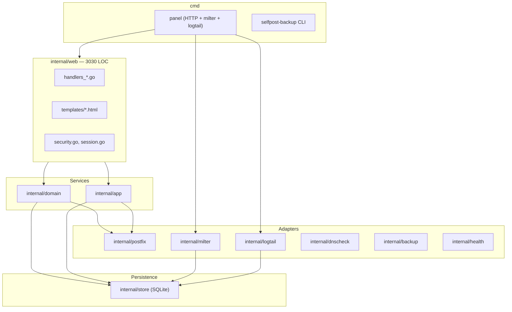

# Рецензирование кодовой базы SelfPost

**Дата:** 2026-08-05  
**Объём ревью:** ~172 файла, 64 Go-исходника (~10 770 строк в `internal/` + `cmd/`), 29 unit-тестов, e2e-модуль `test/e2e/`, 17 HTML-шаблонов, 15 doc-файлов.

Связанные документы: [architecture.md](architecture.md), [security.md](security.md), [implementation-plan.md](implementation-plan.md), [progress.md](progress.md), [roadmap.md](roadmap.md).

---

## Общая оценка

| Критерий | Оценка | Комментарий |
|----------|--------|-------------|
| Архитектура | **Отлично** | Чёткое слоение, минимум связности |
| Сложность vs масштаб | **Отлично** | Без over-engineering |
| Качество кода | **Отлично** | Идиоматичный Go, продуманные rollback-пути |
| Документация | **Хорошо** | As-built docs точны; есть RU/EN split и stale comments |
| Поддерживаемость | **Хорошо** | Высокий порог входа из-за phase-комментариев |
| Логические ошибки | **Минимально** | Критичных багов не найдено; есть принятые операционные gap'ы |
| Legacy | **Низкий** | Только архив spec + phase-комментарии |
| GUI | **Хорошо** | Нет «костылей»; осознанные CSP/layout компромиссы |

**Вывод:** проект готов к релизному тегу после закрытия § D ([implementation-plan.md](implementation-plan.md)) — предрелизного security review. Остальное — polish, не блокеры.

---

## 1. Архитектура и структура проекта

### Текущая структура

### Сильные стороны

- **Layered / ports-and-adapters:** handlers → services (`domain`, `app`) → `store`; инфраструктура изолирована в адаптерах ([`internal/web/web.go`](../internal/web/web.go), [`internal/app/service.go`](../internal/app/service.go)).
- **Composition root** в [`cmd/panel/main.go`](../cmd/panel/main.go): три роли (HTTP, journal-milter, log-tailer) в одном процессе — оправдано для single-container deployment.
- **Interface seams** для тестов: `milter.Store`, `app.SenderMaps`, `logtail.StatusStore`.
- **Embedded migrations** ([`internal/store/store.go`](../internal/store/store.go)) — простой, надёжный подход для 2 миграций.
- **E2E как отдельный модуль** (`test/e2e/go.mod`) — не загрязняет основной модуль.

### Замечания (не блокеры)

- **`internal/web/` — 47 файлов, 3030 строк** — самый крупный пакет. При росте v2.x (роли, inbound relay) стоит выделить подпакеты (`web/handlers`, `web/auth`) или split по доменам. Сейчас — приемлемо.
- **Один SQLite connection** (`MaxOpenConns(1)`) — сознательный trade-off; при росте нагрузки milter + HTTP + logtail будут сериализованы. Документировано, для single-admin panel — норма.

### Рекомендации

| # | Действие | Приоритет |
|---|----------|-----------|
| A1 | Оставить текущую структуру; рефакторинг пакетов — только при старте 2.x | Низкий |
| A2 | Добавить в [architecture.md](architecture.md) диаграмму слоёв (как выше) | Низкий |

**Модель:** Sonnet (документация)

---

## 2. Соответствие сложности масштабу проекта

### Факты

- Outbound SMTP relay + admin panel для одного оператора.
- ~10.7K строк Go, 3 зависимости (`go-milter`, `x/crypto`, `modernc.org/sqlite`).
- Нет ORM, нет SPA, нет message queue — всё уместно.

### Сильные стороны

- Нет лишних абстракций (нет generic repository, нет DI-фреймворка).
- Сервисный слой тонкий, но достаточный: координация SQLite + sasldb2 + Postfix maps ([`internal/app/service.go`](../internal/app/service.go)).
- Fail-open/fail-closed решения явно задокументированы (OpenDKIM tempfail vs journal fail-open).

### Замечания

- **Rate limiting в двух местах** (Postfix anvil L1 + milter L2) — сложность оправдана спецификацией, но требует понимания оператором.
- **Backup с manifest version gate** ([`internal/backup/backup.go`](../internal/backup/backup.go)) — чуть тяжелее минимума, но оправдано для migration safety.

**Вердикт:** сложность **адекватна** масштабу. Over-engineering не обнаружен.

---

## 3. Качество написанного кода

### Сильные стороны

- **Комментарии объясняют «почему»**, не «что» — образцовый уровень ([`internal/web/security.go`](../internal/web/security.go), [`internal/milter/milter.go`](../internal/milter/milter.go)).
- **Rollback-паттерны** при partial failure ([`internal/app/service.go`](../internal/app/service.go) `rollbackCreate`).
- **Ordering guarantees:** SQLite row before SASL write — защита от race и password clobber.
- **Validation centralized:** [`internal/web/validate.go`](../internal/web/validate.go), [`internal/app/validate.go`](../internal/app/validate.go).
- **Atomic file writes** для конфигов ([`internal/postfix/write.go`](../internal/postfix/write.go), [`internal/domain/dkim.go`](../internal/domain/dkim.go)).
- **Test coverage ~45%** file ratio (29 test / 64 source files); ключевые пути покрыты (auth, sessions, milter, backup, dnscheck).

### Замечания

| Файл | Замечание | Severity |
|------|-----------|----------|
| [`internal/web/token.go`](../internal/web/token.go) | `panic` при сбое `crypto/rand` — осознанно, документировано | Info |
| [`internal/web/handlers_domains.go`](../internal/web/handlers_domains.go) | Stale comment: «Applications and send log arrive in later phases» — уже реализовано | Low |
| Phase/spec references | ~50+ файлов с «Phase N», «spec 7.x» — шум для новых контрибьюторов | Low |
| [`cmd/panel/main.go`](../cmd/panel/main.go) | Package comment всё ещё упоминает «Phase 1 stubs» | Low |

### Потенциальные улучшения качества

- Единый проход **gofmt + удаление stale phase-комментариев** (механическая работа).
- Добавить **table-driven test** для edge cases в `parseDelivery` (exotic Postfix status values) — опционально.

**Модель:** Haiku (механическая чистка комментариев), Sonnet (точечные правки)

---

## 4. Полнота документации и соответствие коду

### Сильные стороны

- **[architecture.md](architecture.md)** — as-built source of truth; маршруты, процессы, persistence совпадают с кодом.
- **[security.md](security.md)** — чеклист + принятые риски; каждый риск привязан к коду.
- **[product.md](product.md)** — границы v1.0/out-of-scope чёткие.
- **Regression guard:** [`cmd/panel/envdoc_test.go`](../cmd/panel/envdoc_test.go) — env vars в README = `loadConfig`.
- **CHANGELOG** в формате Keep a Changelog.

### Расхождения docs ↔ code

| Проблема | Где | Реальность |
|----------|-----|------------|
| Image tag `0.1.0` vs «v1.0» | [`deploy/docker-compose.yml`](../deploy/docker-compose.yml) vs README | Roadmap § v1.x — bump при теге |
| Quick start URLs | README | GitHub raw; основной repo — Codeberg |
| `docs/logo` | roadmap | Каталог отсутствует (не «пустой») |
| `docs/specification.md` | documentation-plan D9 | Архивирован в `docs/archive/`; ссылки в коде на «spec 7.x» устарели |
| Phase language в коде | 50+ файлов | Docs говорят «v1.0 done», код — «Phase 14» |
| RU/EN split | progress, roadmap, implementation-plan (RU) vs README/architecture (EN) | Намеренно, но барьер для EN-only contributors |

### Комментирование кода

- **Высокое качество** в security-critical paths.
- **Среднее** в CRUD handlers (делегируют в services — acceptable).
- **Рекомендация:** заменить «spec 7.x» на ссылки на [product.md](product.md) / [security.md](security.md) § или удалить.

**Модель:** Sonnet (docs sync)

---

## 5. Читаемость и поддерживаемость

### Для кого код читаем

- **Go-разработчик со знанием SMTP/Postfix** — да, без проблем.
- **Новичок без почтового бэкграунда** — потребуется [architecture.md](architecture.md) + README.

### Факторы, помогающие поддержке

- Предсказуемая структура handler → service → store.
- Embedded templates (`//go:embed`) — один binary, нет внешних assets.
- Makefile targets: `vet`, `test`, `build`, `e2e`.
- E2E suite покрывает happy path + negatives.

### Факторы, затрудняющие поддержку

- Phase-номера в комментариях без контекста.
- Dual cookie names (`__Host-` vs plain) — хорошо документировано, но неочевидно.
- HTMX fragment polling — нужно понимать SSR + partial updates.
- Dev loop: Windows local edit → SSH to Debian server ([progress.md](progress.md)) — не стандартный `go run`.

### Рекомендации

| # | Действие | Модель |
|---|----------|--------|
| M1 | Cleanup phase-комментариев → «as-built» language | Haiku |
| M2 | Добавить `CONTRIBUTING.md` (dev loop, model routing, commit protocol) — опционально v1.x | Sonnet |
| M3 | Consolidated doc index в README (ссылки на все docs/) | Sonnet |

---

## 6. Логические ошибки и риски

### Критичных багов не обнаружено

E2E покрывает: bootstrap, SMTP AUTH, DKIM, send-log lifecycle, negatives (relay, sender mismatch, L1/L2 limits, milter fail-open, hostname gate, session survive restart).

### Принятые операционные gap'ы (не баги, но важно знать)

| Gap | Описание | Документировано |
|-----|----------|-----------------|
| Send-log `queued` forever | Log-tailer стартует с EOF; после restart пропущенный хвост не дочитывается | [security.md](security.md), [roadmap.md](roadmap.md) |
| CSRF without tokens | POST без Origin/Sec-Fetch-Site пропускается | [security.md](security.md) |
| Fail-open L2 rate limit | DB error → mail проходит | [`internal/milter/ratelimit.go`](../internal/milter/ratelimit.go) |
| Shallow SPF check | Не следует `include:`/`redirect=` | README, `internal/dnscheck/spf.go` |
| Plaintext backup/export at rest | DKIM-ключи, SASL, пароли приложений в cleartext `.tar.gz`/`.json` | **Mitigation:** R13 (optional encryption) |

**Не риск (решение оператора):** «Session resurrection from backup» — снято из [security.md](security.md).

### Потенциальные логические нюансы (низкий приоритет)

1. **Rate limit race:** `CountMessages` + `InsertQueued` не в одной транзакции — при высокой нагрузке возможен overshoot на 1 сообщение. Для differentiated limits — acceptable.
2. **Domain export с plaintext passwords** ([`internal/domain/transfer.go`](../internal/domain/transfer.go)) — by design; **mitigation:** R13 (optional password encryption).
3. **`macro()` dual lookup** ([`internal/milter/milter.go`](../internal/milter/milter.go)) — workaround для Postfix/go-milter; permanent, not a bug.

### Рекомендации

| # | Действие | Приоритет | Модель |
|---|----------|-----------|--------|
| L1 | **Предрелизный security review** (§ D) — обязательный гейт | **P0** | **Fable** |
| L2 | **Шифрование бэкапа и экспорта домена** (R13) — optional, checkbox + password | P1 | **Opus** + Sonnet |
| L3 | Send-log gap mitigation — опционально | P2 | Opus |
| L4 | Transaction wrap для rate limit count+insert — опционально | P3 | Opus |

---

## 7. Legacy-код и миграции

### SQL-миграции

- [`0001_init.sql`](../internal/store/migrations/0001_init.sql) — initial schema
- [`0002_sessions.sql`](../internal/store/migrations/0002_sessions.sql) — sessions (plan B.1)
- Механизм: `PRAGMA user_version`, embedded FS, transactional apply — **чистый**, без legacy branches в коде.

### Архивная документация

- [`docs/archive/specification-v1.0.md`](archive/specification-v1.0.md) — historical; помечен «не источник истины».
- **Рекомендация:** оставить в archive; в коде заменить «spec 7.x» на актуальные doc-ссылки.

### Legacy patterns в runtime

| Элемент | Статус | Действие |
|---------|--------|----------|
| Phase 0–14 comments | Historical noise | Cleanup (Haiku) |
| `macro()` brace workaround | Permanent Postfix compat | Оставить, уже документировано |
| Legacy charset (windows-1251) in milter | Keep raw header on decode fail | Оставить |
| In-memory sessions | **Удалено** (B.1 → SQLite) | Done |
| `copytruncate` log rotation | **Заменено** (B.2 → rename+reload) | Done |

**Перспектива удаления:** единственный кандидат на cleanup — **phase-комментарии** и **архив spec** (оставить файл, убрать ссылки из кода).

---

## 8. GUI: «костыли» и оптимизация компоновки

### Стек

Go `html/template` + HTMX polling + [`panel.css`](../internal/web/static/panel.css) + [`panel.js`](../internal/web/static/panel.js). **Нет React/Vue** — минимальный footprint.

### Поиск маркеров долга

**TODO / FIXME / HACK / kostyl — 0 вхождений** по всему репозиторию.

### Осознанные компромиссы (не костыли)

| Компромисс | Файл | Обоснование |
|------------|------|-------------|
| External CSS/JS only (no inline) | `panel.css`, `panel.js` | CSP `default-src 'self'` |
| HTMX `includeIndicatorStyles: false` | `layout.html` | Avoid CSP exception |
| Block layout for applications (not table) | `panel.css` | 4 cols + 6 controls don't fit 48rem |
| Two-row nav | `panel.css` | Session block vs page links width |
| Page-specific max-width (48/64/24rem) | `panel.css` | Monitoring vs forms |
| Subject ellipsis via inner `` | `panel.css` | `max-width` on `<td>` is advisory |
| Dark mode `!important` overrides | `panel.css` | Override specificity without restructuring |
| HTMX poll excluded from session renewal | `middleware.go` | Idle timeout semantics |
| Dual cookie names | `handlers_auth.go` | `__Host-` requires Secure |

### Возможные оптимизации GUI

| # | Оптимизация | Effort | Модель |
|---|-------------|--------|--------|
| G1 | HTMX polling only when tab visible (`document.visibilityState`) | Low | Sonnet |
| G2 | CSS custom properties для dark mode вместо `!important` cascade | Medium | Sonnet |
| G3 | Consolidate duplicate `main { max-width }` rules | Trivial | Haiku |
| G4 | `hx-trigger="every 5s"` → adaptive interval (5s active, 30s idle) | Low | Sonnet |

**Вердикт:** GUI **не содержит костылей**; все workarounds документированы и оправданы CSP/layout constraints.

---

## 9. Слабо задокументированные спорные решения

### Хорошо задокументированные (security.md + code comments)

- Fail-open journal-milter vs fail-closed OpenDKIM
- CSRF via Origin (no tokens)
- `__Host-` cookie + duplicate detection
- Plaintext passwords in domain export → **mitigation:** R13
- Send-log queued gap
- SQLite single connection
- No in-container TLS

### Требуют усиления документации

| Решение | Текущее состояние | Рекомендация |
|---------|-------------------|--------------|
| **Почему нет CSRF-токенов** (только Origin check) | Частично в security.md | Добавить ADR-style параграф в security.md |
| **Почему panel HTTP, не HTTPS** | README + architecture | Достаточно |
| **Почему chroot disabled в Postfix** | architecture.md | Достаточно |
| **Порядок supervisord** (opendkim → panel → postfix) | architecture.md | Достаточно |
| **Почему log-tailer не persist offset** | roadmap optional | Явно в architecture.md § known limitations |
| **Import domain с plaintext password** | transfer.go comment | Достаточно для v1; шифрование — R13 |
| **Plaintext full backup / domain export at rest** | handlers_backup.go | **R13:** optional AES-GCM envelope (`.spbk`/`.spde`) |

**Модель:** Sonnet (дополнить security.md / architecture.md)

---

## 10. Прочие предложения по оптимизации

### Pre-release (блокеры)

| # | Задача | Модель | Ref |
|---|--------|--------|-----|
| R0 | Security review diff v1.0.0→HEAD + checklist 7.6 | **Fable** | implementation-plan § D |
| R1 | Bump image tag in compose при git tag | Sonnet | roadmap § v1.x |
| R2 | Codeberg URLs в README Quick start | Sonnet | roadmap § v1.x |

### v1.x polish (не блокеры)

| # | Задача | Модель |
|---|--------|--------|
| R3 | Cleanup phase-комментариев (50+ files) | Haiku |
| R4 | Fix stale comment in handlers_domains.go | Haiku |
| R5 | docs/logo: создать или удалить из roadmap | Haiku |
| R6 | GUI: visibility-aware HTMX polling | Sonnet |
| R7 | CONTRIBUTING.md | Sonnet |
| R8 | ADR для CSRF policy | Sonnet |
| R13 | Шифрование бэкапа и экспорта домена (checkbox + password) | **Opus** + Sonnet |

### v2.x (roadmap, не начинать без согласования)

| # | Задача | Модель |
|---|--------|--------|
| R9 | Inbound relay (Phase O1) | **Opus** |
| R10 | Domain-admin role | Opus |
| R11 | Send-log gap fix (persist offset) | Opus |
| R12 | Split internal/web subpackages | Sonnet/Opus |

### CI/infra

- E2E готов (`test/e2e/`); release workflow matrix amd64/arm64 — **хорошо**.
- `go vet` + `go test` на push — **достаточно** для v1.x.
- Рекомендация: добавить `gofmt -l` check в CI (progress.md упоминает как manual step).

**Модель:** Haiku (CI one-liner)

---

## План реализации (приоритизированный)

### Фаза 0 — Гейт релиза (P0)

1. Fable: `/security-review` по diff v1.0.0...HEAD
2. Fable: ручной проход security.md checklist § 7.6
3. Каждая finding → fix ИЛИ запись в security.md
4. `make e2e` зелёный (уже готов)
5. Sonnet: bump compose image tag + Codeberg URLs (в том же release commit)
6. Git tag vX.Y.Z

### Фаза 1.5 — Шифрование резервных копий (P1, v1.x)

**Проблема:** полный бэкап и экспорт домена содержат DKIM-ключи, SASL-креды и plaintext-пароли приложений; сейчас `.tar.gz` / `.json` без шифрования.

**Решение:** опциональное шифрование паролем (чекбокс «Encrypt with password»; поля password + confirm — только при включённой галочке; переключение в `panel.js`, без inline script).

| Арtefact | Cleartext | Encrypted |
|----------|-----------|-----------|
| Полный бэкап | `.tar.gz` | `.spbk` (**S**elf**P**ost **B**ac**k**up) |
| Экспорт домена | `.json` | `.spde` (**S**elf**P**ost **D**omain **E**xport) |

**Формат:** magic `SELFPOST1`, type byte, scrypt KDF, AES-256-GCM; manifest внутри ciphertext.

**Задачи:** E1 crypto envelope → E2 backup/CLI → E3 domain export/import → E4 UI (checkbox) → E5 docs + e2e. **Модель:** Opus (crypto), Sonnet (UI/docs).

### Фаза 1 — Doc/code hygiene (P1)

1. Haiku: массовая замена phase-комментариев (mechanical pass)
2. Haiku: fix handlers_domains.go stale comment
3. Sonnet: ADR CSRF в security.md
4. Sonnet: known limitations § в architecture.md (send-log gap)
5. Haiku: docs/logo resolve
6. Haiku: gofmt CI check

### Фаза 2 — GUI polish (P2, optional)

1. Sonnet: HTMX visibility-aware polling (panel.js)
2. Sonnet: CSS custom properties для dark mode
3. Haiku: consolidate main max-width rules

### Фаза 3 — Operational improvements (P2–P3, optional)

1. Opus: send-log read offset persistence
2. Opus: rate limit count transaction wrap

---

## Маршрутизация моделей (сводная таблица)

| Тип работы | Модель | Обоснование |
|------------|--------|-------------|
| Security review (не authorship) | **Fable** | Независимость от автора (Opus) |
| Security fixes, infra, Postfix | **Opus** | Risk-critical |
| UI, docs, CSS, templates | **Sonnet** | Баланс качества и скорости |
| Mechanical cleanup, CI, trivial fixes | **Haiku** | Минимальный scope |
| Inbound relay 2.x | **Opus** | Open relay risk |

*Источник правил:* [progress.md](progress.md) § «Модель по типу работы», [development.md](development.md) § Agent rules.
