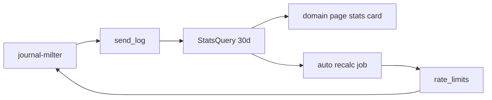

# Plan: domain-stats-auto-ratelimit

**Status:** candidate  
**Date:** 2026-08-17  
**Version:** `1.x` MINOR; migrations must stay compatible with `1.0.0`.

---

## Goal

Give the operator **30-day sending statistics** per domain and per application
(total volume, peak and average rate), and an optional **auto** level-2 rate
limit that sets `max_messages` from the average rate (avg × multiplier) over the
level-1 window.

## Scope

**In:**

- Rolling **30-day** stats on each domain page (domain aggregate + per-app rows):
  message count, peak msg/h, average msg/h.
- Level-2 rate limit mode **manual** (today) or **auto** for domain and
  application scopes.
- Auto formula: `max_messages = ceil(avg_hourly × multiplier)`, window =
  level-1 window (`RATE_LIMIT_WINDOW_SECONDS`); capped at level 1.
- Background recalculation (e.g. every 6 h, alongside send-log prune); milter
  reads stored `max_messages` / `window_seconds` only (no aggregates on the
  hot path).
- Panel UI: stats card, manual/auto toggle, multiplier field, read-only computed
  limit in auto mode, optional «Recalculate now».
- RBAC: domain-admin sees stats and may configure auto/manual for assigned
  domains only; same authz as existing rate-limit handlers.
- Tests, [guide.md](../guide.md), [CHANGELOG.md](../../CHANGELOG.md); security
  review (Fable) for rate-limit path changes.

**Out:**

- Changing level 1 (Postfix env) — auto only fills level 2 under the L1 cap.
- Automated IP warmup schedules ([guide.md](../guide.md) § IP warmup stays
  operator-driven).
- Prometheus/Grafana, alerting, APIs.
- Counting level-1 refusals or `rejected` rows as sent volume.
- Per-client-IP analytics.

## Data source

All metrics come from SQLite `send_log`, same rules as
[`CountMessages`](../../internal/store/ratelimits.go):

- One message = one distinct `queue_id` (many recipients = one count).
- `status != rejected` (level-2 refusals never queued).
- Level-1 refusals are **not** in `send_log` — stats under-count refusals;
  document in UI copy.

Retention today is env `SEND_LOG_RETENTION_DAYS` (default 90). Stats use the
last **30 days** of rows still present. If retention &lt; 30 days (after
[send-log-retention](send-log-retention.md)), the stats window is
`min(30, retention)` with a warning.

### Metrics

| Metric | Definition |
|---|---|
| **total** | `COUNT(DISTINCT queue_id)` in the stats window |
| **peak rate** | maximum messages in any **hourly** bucket in that window (msg/h) |
| **avg rate** | `total / hours_in_window`, where `hours_in_window = min(720, age of domain/app in hours, retention hours)` |

Keys: `send_log.domain` (domain scope), `send_log.app_login` (application scope).

## Architecture



1. **[`internal/store/stats.go`](../../internal/store/stats.go)** — `SendStats`
   with `Total`, `PeakPerHour`, `AvgPerHour`; `DomainSendStats(name, since)` /
   `AppSendStats(login, since)`.
2. Hourly buckets: `strftime('%Y-%m-%d %H', created_at)` + `GROUP BY`; subquery
   for peak; total via distinct `queue_id`.
3. Indexes `idx_send_log_domain` and `idx_send_log_created_at` exist; add
   composite `(domain, created_at)` only if profiling shows need.
4. **Auto recalc** — panel goroutine (same interval as send-log prune): for each
   `rate_limits` row with `mode = auto`, recompute `max_messages`, set
   `auto_updated_at`. Milter unchanged except reading new columns via existing
   `RateLimit` lookup.

### Auto rate limit

Extend [`RateLimit`](../../internal/store/ratelimits.go):

```go
type RateLimit struct {
    // existing: Scope, RefID, AllowedIPs, MaxMessages, WindowSeconds
    Mode           string  // "manual" | "auto"
    AutoMultiplier float64 // default 2.5 when Mode == "auto"
    AutoUpdatedAt  time.Time
}
```

**Formula:**

```
avg_hourly = total_messages_in_window / hours_in_window
max_messages = ceil(avg_hourly * auto_multiplier)
window_seconds = L1 window (not editable in auto mode)
max_messages = min(max_messages, L1 max)
```

When `total == 0`: auto limit stays **inactive** (same as empty manual limit);
UI explains that traffic is required before auto can apply.

**Application overrides** ([`handlers_ratelimit.go`](../../internal/web/handlers/handlers_ratelimit.go)):

- Trusted IPs required.
- Auto app ceiling **strictly above** domain limit when domain limit is active.
- Ceiling ≤ L1.

**Fail-open:** store errors during recalc must not weaken enforcement of the
last successfully written limit; recalc failures are logged only.

### Migration (`0006_rate_limit_auto.sql`)

```sql
ALTER TABLE rate_limits ADD COLUMN mode TEXT NOT NULL DEFAULT 'manual'
  CHECK (mode IN ('manual', 'auto'));
ALTER TABLE rate_limits ADD COLUMN auto_multiplier REAL;
ALTER TABLE rate_limits ADD COLUMN auto_updated_at TEXT;
```

Existing rows → `manual`.

### Domain export

Today rate limits are **not** exported. This plan adds them (including
`mode`, `auto_multiplier`) to domain transfer JSON — document as a boundary
change in [guide.md](../guide.md) § Export.

## Panel UI

- Domain page ([`domain_detail.html`](../../internal/web/view/templates/domain_detail.html)):
  - **Sending statistics (30 days)** — total, peak msg/h, avg msg/h.
  - Per-application stats in the app list.
  - Rate limit: Manual / Auto, multiplier (e.g. 1.5–5.0, default 2.5), read-only
    computed max/window in auto mode, «Recalculate now».
- Optional later: «30d» column on domain list (global admin only).

## Tests

- `internal/store/stats_test.go` — fixtures → total / peak / avg.
- `internal/store/ratelimits_test.go` — auto recalc, L1 cap, app &gt; domain.
- Handler tests — auto form validation, multiplier bounds.
- Milter tests — enforced limit matches last recalculated values.

`go test` / `go vet` on touched packages.

## Done when

- Domain and app 30-day stats visible on the domain page; domain-admin scoping
  enforced.
- Manual/auto toggle works for domain and app; auto recalc updates `rate_limits`
  and milter enforces stored ceilings.
- Zero-traffic auto stays inactive with clear UI copy.
- [guide.md](../guide.md) and [CHANGELOG.md](../../CHANGELOG.md) updated;
  security review passed.

## Risks

- Heavy aggregation on large `send_log` tables — mitigate with indexes or
  nightly rollups (phase 2).
- Stats without level-1 visibility — mitigate with operator-facing caveat.
- Auto limit too tight after a spike — multiplier is operator-tuned; show peak
  alongside avg in auto UI.

## Dependencies

- [`send-log-retention`](send-log-retention.md) is a separate roadmap item but
  should land before or in parallel so operators can set retention ≥ 30 days
  from the panel.

**Version:** `1.x` MINOR.

## Implementation checklist

Target version cut: **`1.6.0`** (MINOR). One commit per step; code only after
roadmap status is **agreed**. See [development.md](../development.md) § Plan
checklists.

- [ ] Migration `0006_rate_limit_auto.sql` (`mode`, `auto_multiplier`, `auto_updated_at`) — **Opus**
- [ ] `internal/store/stats.go`: total / peak / avg over 30 days — **Opus**
- [ ] Auto recalc job (6h): `ceil(avg × multiplier)`, L1 cap, fail-open on error — **Opus**
- [ ] Extend `RateLimit` + handler forms (manual/auto) — **Opus**
- [ ] Domain page stats card + per-app stats (`domain_detail.html`) — **Sonnet**
- [ ] Domain export JSON includes rate limits — **Opus**
- [ ] Milter tests — enforced limit matches stored ceiling — **Opus**
- [ ] Store and handler tests — **Sonnet**
- [ ] [guide.md](../guide.md) — **Sonnet**
- [ ] Security review rate-limit path — **Fable**
- [ ] `go vet`, `go test` on touched packages — **Haiku**
