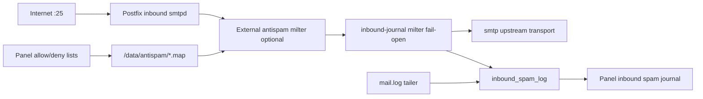

# Plan: inbound-antispam-panel

**Status:** agreed  
**Date:** 2026-08-19  
**Version:** `1.10.0` MINOR (opt-in; no change to outbound-only or inbound-without-filter paths).

---

## Goal

Give the operator a **panel view of inbound anti-spam decisions** and **editable
allow/deny lists** that tune filter behaviour — without SelfPost shipping or
starting an anti-spam engine ([product.md](../product.md) out-of-scope list
unchanged).

Typical journal row:

| When | From | To | Subject | Decision |
|------|------|----|---------|----------|
| 2026-08-19 09:14 | `spammer@evil.example` | `user@inbound.example` | Cheap pills | reject (rspamd: BAYES_SPAM +0.95) |

Lists let the operator correct false positives/negatives (e.g. always allow
`billing@vendor.example`, block `192.0.2.0/24`).

## Context (as-built)

- Inbound relay ships in `[1.4.0]` (`INBOUND_RELAY_ENABLE`); optional
  `INBOUND_ANTISPAM_MILTER` attaches an **external** filter (documented rspamd
  sidecar in [deploy/antispam/docker-compose.antispam.yml](../../deploy/antispam/docker-compose.antispam.yml)).
- The inbound smtpd has **no journal-milter** today — only outbound 465/587
  writes `send_log` ([architecture.md](../architecture.md)).
- Inbound UI and handlers are **global-administrator only** today
  (`requireInbound` → `requireGlobal`).

## Quarantine

**Not in this plan.** Held-mail review/release is tracked separately as roadmap
candidate [inbound-quarantine](inbound-quarantine.md). The journal may still
record a `quarantine` **decision label** when the external filter reports it,
without SelfPost storing the message.

**DMARC `p=quarantine`** remains unrelated (outbound policy for receivers).

## Decisions (closed 2026-08-19)

### Capture mechanism

**Inbound journal-milter in `panel` only** — no rspamd history API polling in v1.
A separate unix socket (`INBOUND_JOURNAL_MILTER_SOCKET`, default
`/run/selfpost/inbound-journal.sock`) on the inbound smtpd only; fail-open
(`default_action=accept`).

**Milter order on port 25** (when antispam is enabled):

```text
smtpd_milters = { antispam, inbound-journal }
```

Antispam runs first; inbound-journal runs at end-of-message on the **accept**
path and reads rspamd-added headers (`X-Rspamd-Action`, `X-Rspamd-Score`, symbol
summary when present).

**Antispam rejects** do not reach end-of-message on the journal milter. v1 also
tails `mail.log` for inbound `postfix/smtpd` **`milter-reject`** / **`reject`**
lines and inserts journal rows (client IP, envelope from/to when logged, reason
text, subject empty if rejected before DATA). DMARC-ingest pipe traffic is out
of scope for this tailer.

### Journal without `INBOUND_ANTISPAM_MILTER`

Journal stays **on** whenever `INBOUND_RELAY_ENABLE=true` (not tied to the
antispam hook). Without an external filter:

- **accept** rows — message relayed (engine `selfpost`, detail empty);
- **reject** / **tempfail** rows — from the mail.log tailer (Postfix policy,
  size limit, unknown recipient, etc.).

Panel copy explains that rspamd symbols appear only when the antispam milter is
configured.

### RBAC

**Global administrator only** for journal and lists — same as inbound relay. No
domain-admin access in v1.

### Retention

Mirror send-log retention:

- Settings key `inbound_spam_log_retention_days` on `/settings` (global admin).
- Default **90** days; validation **7–365**; seed from env
  `INBOUND_SPAM_LOG_RETENTION_DAYS` when the setting is missing.
- Prune every **6 hours** (same cadence as send-log retention).
- Hard cap **10 000** rows after age prune (drop oldest) — busier than DMARC
  reports, lighter than unbounded growth.

### Allow/deny lists

| Topic | Decision |
|-------|----------|
| Entry types | sender address, sender domain (`@domain` suffix), client IP / CIDR |
| Precedence | **deny overrides allow** |
| Scope | instance-wide (not per inbound domain in v1) |
| Where applied | **rspamd map files** under `/data/antispam/` (allow.map, deny.map); documented compose fragment mounts them into the sidecar |
| SelfPost pre-check | **out of v1** — lists live in rspamd only |
| Edit access | global administrator only |
| When inactive | lists editable in the panel but UI warns that sync applies only when `INBOUND_ANTISPAM_MILTER` is set; `postfix reload` / rspamd reload documented in guide |

List change → atomic map rewrite (same pattern as Postfix maps) → rspamd reload
via documented operator step or sidecar `SIGHUP` in the compose fragment.

### Activation

| Condition | Behaviour |
|-----------|-----------|
| `INBOUND_RELAY_ENABLE=false` | no inbound journal milter, no UI, no tables written |
| inbound on, antispam empty | journal + UI; lists visible but marked inactive for filter sync |
| inbound on + antispam set | full journal (symbols on accept) + list sync |

No separate feature flag beyond inbound relay + existing antispam env vars.

### UI

New nav item **Inbound spam** (or subsection under **Inbound**) — journal table
with filters (decision, domain, date range), list management on the same page or
a tab. Mockup: add `docs/assets/panel-ui/inbound_spam.html` in the panel step.

## Schema (migration `0010_inbound_spam_log.sql`)

**`inbound_spam_log`**

| Column | Type | Notes |
|--------|------|-------|
| `id` | INTEGER PK | |
| `inbound_domain` | TEXT NOT NULL | recipient domain (from `relay_domains`) |
| `client_ip` | TEXT NOT NULL | |
| `from_addr` | TEXT NOT NULL | envelope from |
| `to_addr` | TEXT NOT NULL | envelope to (one row per recipient) |
| `subject` | TEXT NOT NULL | truncated with `mailhdr.SubjectMaxRunes` (200) |
| `decision` | TEXT NOT NULL | `accept`, `reject`, `tempfail`, `quarantine` |
| `engine` | TEXT NOT NULL | `rspamd`, `postfix`, `selfpost` |
| `detail` | TEXT NOT NULL | symbol/score summary or log-line reason; may be empty |
| `created_at` | TEXT NOT NULL | RFC3339 UTC |

Index on `(created_at)`, `(inbound_domain, created_at)`.

**`inbound_spam_list`**

| Column | Type | Notes |
|--------|------|-------|
| `id` | INTEGER PK | |
| `list_type` | TEXT NOT NULL | `allow` or `deny` |
| `entry_type` | TEXT NOT NULL | `address`, `domain`, `ip` |
| `value` | TEXT NOT NULL | normalized entry |
| `note` | TEXT NOT NULL | operator comment; default `''` |
| `created_at` | TEXT NOT NULL | |

Unique on `(list_type, entry_type, value)`.

## Scope

**In:**

- Schema, store CRUD, retention loop, mail.log tailer extension for inbound
  rejects.
- Inbound journal-milter (fail-open) + Postfix `postfix-config.sh` wiring.
- rspamd map sync under `/data/antispam/`.
- Panel journal + list UI (global admin).
- Full backup includes `/data/antispam/` and new SQLite tables.
- Tests; [guide.md](../guide.md); [architecture.md](../architecture.md).

**Out:**

- Shipping rspamd, ClamAV, or any filter binary inside the SelfPost image.
- Outbound spam filtering.
- [inbound-quarantine.md](inbound-quarantine.md) storage/release.
- rspamd rule editing, Bayes training UI, antivirus.
- MIME replay from the panel (metadata only).
- Per-domain lists; domain-admin RBAC.
- rspamd history API polling.

## Architecture



## Security

- Same validation whitelists as inbound relay ([security.md](../security.md)).
- Journal rows contain PII — retention and global-admin-only access.
- Inbound journal milter fail-open must not block mail (backup-MX role).
- List map writes injection-safe; deny wins over allow.

## Done when

- With inbound relay + antispam sidecar, panel shows accept rows with symbols
  and reject rows from mail.log tailing.
- Operator can add/remove list entries; a test message reflects allow/deny.
- With antispam hook off, journal still shows Postfix-level decisions; list UI
  shows inactive sync notice.
- `go vet`, `go test`, image build green; guide and architecture updated.

## Risks

- rspamd header/symbol format drift — thin parser, pin sidecar tag in compose.
- Journal volume — retention + 10k cap.
- mail.log parse brittleness — unit tests on sample lines; inbound smtpd only.

## Dependencies

- [inbound-relay.md](inbound-relay.md) (shipped).

## Model routing (this plan)

| Role | Model |
|------|-------|
| All implementation (code, tests, docs) | **Composer** |
| Technical review (reviewer ≠ author) | **Opus** |
| Security review | **Fable** |

Composer ships each step; Opus reviews the accumulated diff once implementation
steps are done (fix loop: Composer addresses Opus findings, Opus re-checks).
Fable runs after Opus sign-off.

## Implementation checklist

Target version cut: **`1.10.0`** (MINOR). One commit per step;
[development.md](../development.md) § Plan checklists.

- [x] Agree journal fields, retention, and RBAC (this plan § Decisions) — **Composer**
- [ ] Migration `0010_inbound_spam_log.sql` — **Composer**
- [ ] Inbound journal-milter + Postfix wiring — **Composer**
- [ ] mail.log tailer: inbound reject rows — **Composer**
- [ ] List CRUD + validation + atomic rspamd map sync — **Composer**
- [ ] Panel: journal + lists UI (+ mockup) — **Composer**
- [ ] Backup includes `/data/antispam/` — **Composer**
- [ ] Unit + handler tests — **Composer**
- [ ] [guide.md](../guide.md), [architecture.md](../architecture.md) — **Composer**
- [ ] `go vet`, `go test`, e2e if applicable — **Composer**
- [ ] Technical review of inbound antispam changes — **Opus**
- [ ] Security review inbound antispam path — **Fable**
