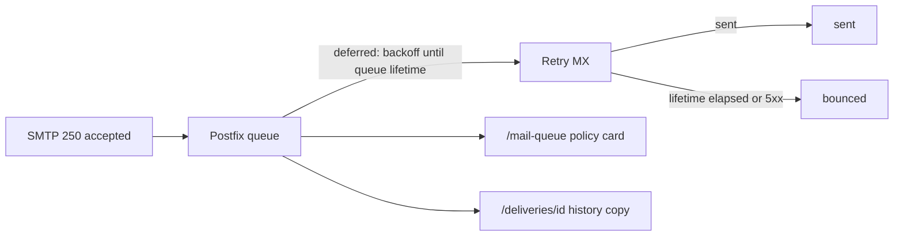

# Plan: queue-retries (Postfix retry policy in the panel)

**Status:** done — shipped in `[1.3.1]` (2026-08-17)  
**Date:** 2026-08-13  
**Version:** patch; no schema, no configuration surface.  
**Order:** small panel item; does not wait on inbound-relay.

---

## Goal

Show the operator how Postfix retries deferred mail: first retry delay, later
backoff cap, and how long a message stays in the queue before it bounces. The
numbers come from this container's effective Postfix config, not from
hard-coded copy.

## Scope

**In:**

- A static «How delivery retries work» card on `/mail-queue` (global
  administrator). Not inside the HTMX poll fragment — the snapshot is taken at
  panel start.
- The same human-readable intervals in `/deliveries/{id}` history for
  `deferred` and `bounced` (domain administrators never see Mail queue).
- Operator docs: [guide.md](../guide.md) Mail queue bullet;
  [architecture.md](../architecture.md) notes the one-shot `postconf -h` at
  panel start. [CHANGELOG.md](../../CHANGELOG.md) `### Added`.

**Out:**

- Changing Postfix retry parameters, or exposing them as panel settings
  ([product.md](../product.md): Postfix is used as-is).
- An `attempts` column on `send_log`, or «attempt 3 of N» — Postfix has no
  attempt budget; it is time-based.
- Counting `status=deferred` lines in `mail.log` or reading `postcat`. Each
  attempt is already on the delivery page's log table; the journal stores only
  the last status.
- Duplicating the card on Status (summary + link to Mail queue already exist).
- Re-reading `postconf` on every HTTP request.

## Architecture

Acceptance is still synchronous SMTP. Delivery stays in Postfix's on-disk
queue. SelfPost does not enqueue, retry, or deliver.



[build/postfix-config.sh](../../build/postfix-config.sh) does not set
`queue_run_delay`, `minimal_backoff_time`, `maximal_backoff_time`,
`maximal_queue_lifetime`, `bounce_queue_lifetime`, or `delay_warning_time`.
Debian/Postfix 3.x compiled-in defaults therefore apply unless the operator
overrides them (`postconf -e` inside the container).

### Loading the numbers

Once, when the HTTP role starts ([cmd/panel/httpserver.go](../../cmd/panel/httpserver.go),
after `postfix-config.sh` has run):

```
postconf -h queue_run_delay minimal_backoff_time maximal_backoff_time maximal_queue_lifetime bounce_queue_lifetime delay_warning_time
```

`postconf -h`, not a parse of `/etc/postfix/main.cf`: stock values are not
written to the file. `postconf` is the effective config, including a manual
override.

- Fixed argv, no user input — same pattern as
  [postfix.Queue](../../internal/postfix/queue.go) /
  [security.md](../security.md).
- Cache on `handlers.Config` (via `web.Config`). The HTMX fragment does not
  call `postconf`.
- A live `postconf -e` is visible after the next panel (or container) restart.
  While the process is up, the panel shows the start-up snapshot.
- Parse Postfix time units (`300s`, `5d`, `1h`, a bare number is seconds) in
  `internal/postfix`. Format human strings (`5 minutes`, `5 days`,
  `about 1 hour 7 minutes`) in one place so the Mail queue card and
  `deliveryEvents` cannot drift.
- If `postconf` is missing (unit tests on Windows, binary outside the
  container): log a warning, fall back to Postfix 3.x compiled-in defaults
  (`300s` / `4000s` / `5d` / `0`), and put a muted note on the card. Tests
  stub the lookup (as `queueIDs` in the log-tailer) or pass a fixture on
  `Config`. Do not fail panel start.

Typical stock values, for orientation only — the UI prints whatever
`postconf` returned:

| Parameter | Stock | Meaning |
|---|---|---|
| `queue_run_delay` / `minimal_backoff_time` | `300s` | First retry and deferred-queue scan |
| `maximal_backoff_time` | `4000s` | Cap on the doubling gap (~1 h 7 min) |
| `maximal_queue_lifetime` | `5d` | Then bounce |
| `delay_warning_time` | `0` | No delay warning to the sender |

## Panel copy

Mail queue card facts: first retry; later retries (doubling, capped);
kept in queue; then bounced. Short prose: there is no fixed attempt count; a
`deferred` message stays in this listing until it is delivered or the queue
lifetime runs out.

`deliveryEvents(row, policy)`:

- `deferred`: retries, first after X, then with increasing gaps up to Y, for
  up to Z.
- `bounced`: or Postfix gave up after Z in the queue.

## Tests

- Duration parser: `5d`, `300s`, `4000s`, `1h`, `0`, bare number.
- `/mail-queue` handler: card shows the fixture policy's human strings, not a
  live `postconf`.
- Delivery page / `deliveryEvents`: `deferred` and `bounced` contain those
  strings ([handlers_monitor_test.go](../../internal/web/handlers/handlers_monitor_test.go)).
- [templates_test.go](../../internal/web/view/templates_test.go): pass the new
  fields if rendering `mail_queue` requires them.

`go test` / `go vet` on the touched packages.

## Done when

- `/mail-queue` states this Postfix's first retry, backoff cap, and queue
  lifetime.
- A `deferred` / `bounced` delivery page uses the same intervals.
- A manual `postconf -e maximal_queue_lifetime=2d` followed by a panel restart
  changes what the panel prints.
- Guide and architecture describe the snapshot; CHANGELOG has an Added entry.

## Risks

- Showing compiled-in fallbacks when `postconf` failed would mislead if the
  operator had overridden them — mitigate with the muted note on the card.
- Inventing a max-attempt count would be false; the copy must stay time-based.

## Implementation checklist

Target version cut: **`1.3.1`** (PATCH). One commit per step; see
[development.md](../development.md) § Plan checklists.

- [x] `internal/postfix`: parse Postfix time units (`5d`, `300s`, bare seconds) + tests — **Opus**
- [x] `internal/postfix`: one-shot `postconf -h` (six keys), fallback + warn — **Opus**
- [x] Load policy at HTTP start in `cmd/panel/httpserver.go`; cache on handlers config — **Opus**
- [x] Human-readable duration formatter (shared by Mail queue card and delivery history) — **Sonnet**
- [x] «How delivery retries work» card on `/mail-queue` (outside HTMX fragment) — **Sonnet**
- [x] `deliveryEvents(row, policy)` — intervals in deferred/bounced copy — **Sonnet**
- [x] Handler and template tests (`handlers_monitor_test.go`, `templates_test.go`) — **Sonnet**
- [x] [guide.md](../guide.md) and [architecture.md](../architecture.md) — **Sonnet**
- [x] `go vet`, `go test` on touched packages — **Haiku**
