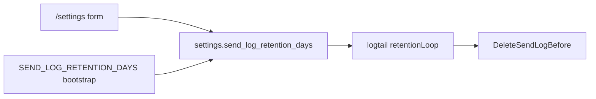

# Plan: send-log-retention

**Status:** done  
**Date:** 2026-08-17  
**Version:** `1.x` MINOR; no schema migration required (uses existing `settings` table).

---

## Goal

Let the **global administrator** change how long delivery journal rows
(`send_log`, `/deliveries`) are kept, from the panel — without editing `.env`.

## Context (as-built)

Retention **already exists**, but only via environment:

- `SEND_LOG_RETENTION_DAYS` (default **90**) in `.env` / Compose.
- [`cmd/panel/main.go`](../../cmd/panel/main.go) passes it to
  [`logtail.Run`](../../internal/logtail/logtail.go).
- [`retentionLoop`](../../internal/logtail/logtail.go) prunes via
  [`DeleteSendLogBefore`](../../internal/store/sendlog.go) every **6 hours**.
- No panel control; [`handlers_monitor.go`](../../internal/web/handlers/handlers_monitor.go)
  hardcodes «ninety days» in copy.
- Migration `0001_init.sql` describes `settings` as the place for «retention
  overrides», but no UI writes that key yet.

This plan moves the **effective** retention into SQLite `settings`, with env as
bootstrap only.

## Scope

**In:**

- Settings card on `/settings` (global administrator only): **Send log
  retention (days)**.
- Key `send_log_retention_days` in [`settings`](../../internal/store/settings.go).
- Validation: integer range **7–365** (exact bounds fixed at implementation).
- On first use: if setting missing, seed from env
  (`SEND_LOG_RETENTION_DAYS`, default 90) at panel start or first save.
- Log-tailer reads the setting **each prune cycle** (no container restart).
- Delivery pages and guide copy show the **current** retention, not a hardcoded
  90.
- Tests; [guide.md](../guide.md); [CHANGELOG.md](../../CHANGELOG.md).

**Out:**

- Per-domain retention (instance-wide only).
- `mail.log` rotation (logrotate, 14 daily files — unchanged).
- Immediate prune on save when lowering retention (next 6 h cycle is enough;
  optional «Prune now» not in v1).
- Domain-admin access to this setting.

## Architecture

1. **Read path** — `GetSendLogRetentionDays()`: settings value if valid, else env
   default.
2. **Write path** — POST `/settings` (global admin): validate, `SetSetting`,
   flash confirmation.
3. **Prune path** — change [`logtail.retentionLoop`](../../internal/logtail/logtail.go)
   to accept `func() int` or `RetentionReader` that queries settings each cycle
   (same 6 h ticker).
4. **Copy** — inject retention days into delivery list/detail templates and
   remove hardcoded «ninety days».

`SEND_LOG_RETENTION_DAYS` remains documented in [guide.md](../guide.md) as the
**initial default** until changed in Settings.

## Relation to domain-stats-auto-ratelimit

[domain-stats-auto-ratelimit](domain-stats-auto-ratelimit.md) uses a **30-day**
stats window. Requires effective retention ≥ 30 for full accuracy. When
retention &lt; 30:

- Stats UI shows a warning and uses `min(30, retention)` as the window, or
- Settings validation warns when saving a value below 30 while stats/auto are
  enabled (pick one at implementation; document in guide).

Recommended roadmap order: **send-log-retention** before or parallel with
domain-stats-auto-ratelimit.

## Panel UI

New card on [`settings.html`](../../internal/web/view/templates/settings.html)
(global admin block, near rate limits or under a «Deliveries» heading):

- Number input: retention days (7–365).
- Muted copy: rows older than this are deleted from `/deliveries`; main driver
  of `/data` growth; does not affect `mail.log` rotation.

Domain administrators keep the narrow credentials-only settings page.

## Tests

- Save/load setting; reject out-of-range values.
- `retentionLoop` uses updated value without process restart (mock reader).
- Bootstrap: empty settings → env default used for prune.
- Template/delivery copy reflects configured days.

`go test` / `go vet` on touched packages.

## Done when

- Global admin can set retention on `/settings`; value persists in SQLite.
- Prune uses the panel value on the next cycle; env remains bootstrap default.
- Guide documents panel vs env; CHANGELOG entry added.
- Hardcoded «ninety days» removed from delivery UI.

## Risks

- Operator lowers retention while bookmarking old delivery URLs — existing
  behaviour; copy already notes pruned rows are gone.
- Settings change without restart — must be tested so log-tailer never keeps a
  stale int from panel start only.

**Version:** `1.x` MINOR.

## Implementation checklist

Target version cut: **`1.5.0`** (MINOR). One commit per step; code only after
roadmap status is **agreed**. See [development.md](../development.md) § Plan
checklists.

- [x] `GetSendLogRetentionDays` / `SetSetting` key `send_log_retention_days` (7–365) — **Opus**
- [x] Bootstrap from `SEND_LOG_RETENTION_DAYS` when settings empty — **Opus**
- [x] `logtail.retentionLoop`: read setting each prune cycle — **Opus**
- [x] Settings card on `/settings` (`settings.html`) — **Sonnet**
- [x] Remove hardcoded «ninety days» in handlers and templates — **Sonnet**
- [x] Tests: save/load, range, loop without restart — **Sonnet**
- [x] [guide.md](../guide.md) — **Sonnet**
- [x] `go vet`, `go test` on touched packages — **Haiku**
